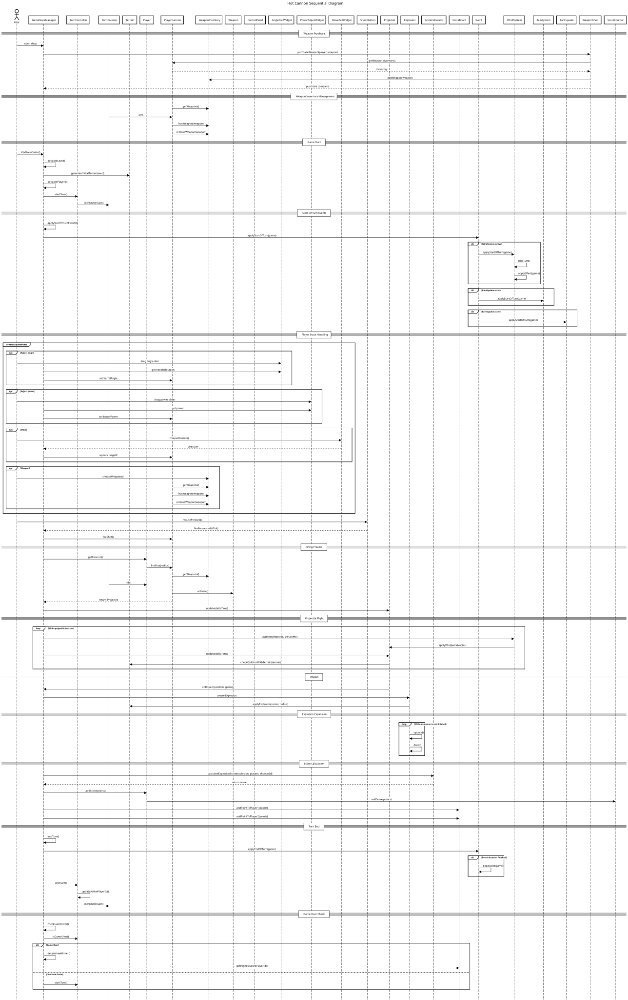

# 2026-group-17
2026 COMSM0166 group 17

# COMSM0166 Project Template
A project template for the Software Engineering Discipline and Practice module (COMSM0166).

## Info

This is the template for your group project repo/report. We'll be setting up your repo and assigning you to it after the group forming activity. You can delete this info section, but please keep the rest of the repo structure intact.

You will be developing your game using [P5.js](https://p5js.org) a javascript library that provides you will all the tools you need to make your game. However, we won't be teaching you javascript, this is a chance for you and your team to learn a (friendly) new language and framework quickly, something you will almost certainly have to do with your summer project and in future. There is a lot of documentation online, you can start with:

- [P5.js tutorials](https://p5js.org/tutorials/) 
- [Coding Train P5.js](https://thecodingtrain.com/tracks/code-programming-with-p5-js) course - go here for enthusiastic video tutorials from Dan Shiffman (recommended!)

## HOT CANNONS

HOT CANNONS is a two-player, turn-based artillery game inspired by Pocket Tanks, featuring a wide variety of random events that make each match unpredictable and dynamic. These events include switches between Day Mode and Dark Mode that affect visibility, weather effects such as acid rain and strong winds that alter damage and projectile behavior, and teleportation events that suddenly relocate cannons to different positions on the map. In addition, players can purchase various types of shots in a shop screen, combining weapons adapted from Pocket Tanks with newly designed ones. This system encourages players to plan ahead and customize their loadouts according to their preferred playstyle. On each turn, players must carefully choose which shot to use based on terrain conditions, available resources, and their overall strategy. The combination of strategic decision-making and unpredictable events ensures that no two matches play out the same, encouraging players to return to the game repeatedly. Overall, HOT CANNONS delivers a strategic and highly replayable game experience by blending classic artillery mechanics with dynamic environments, player choice, and elements of randomness.

STRAPLINE. Add an exciting one sentence description of your game here.

IMAGE. Add an image of your game here, keep this updated with a snapshot of your latest development.

VIDEO. Include a demo video of your game here (you don't have to wait until the end, you can insert a work in progress video)

https://github.com/user-attachments/assets/d481b491-efc3-44cc-9b79-187f7e841b5e

## Development Team

- Nikolay Slavov, ji25441@bristol.ac.uk, Dozuu-Touryou
- Shiho Morimatsu, rz25939@bristol.ac.uk, shiho1008
- Yinuo Li, cs25733@bristol.ac.uk, Liyinuo123
- Yuxin Hu, fx25208@bristol.ac.uk, Cindy04869
- Hsin-Man Liu, cw25376@bristol.ac.uk, hsinmanliu
- Yuqi Guo, rr24582@bristol.ac.uk, Allison-coder

## Project Report

### Introduction

- 5% ~250 words 
- Describe your game, what is based on, what makes it novel? (what's the "twist"?) 

### Requirements 

- 15% ~750 words
- Early stages design. Ideation process. How did you decide as a team what to develop? Use case diagrams, user stories. 

### Design

### Initial Design
In the early stages of development, our primary goal was to establish a functional prototype centered on core mechanics: turn-based artillery combat and a destructible environment. We initially conceived a centralized architecture where a single manager coordinated the game's high-level flow. This initial design is illustrated in the class diagram below (Figure xx).

<figure style="text-align:center;">
  

  <figcaption>
    <b>Figure x:</b> bInitial Design diagram
  </figcaption>
</figure>

In the early development stage, a central **GameStateManager** class was responsible for coordinating most aspects of the gameplay loop, including terrain generation, turn handling, player management, event processing, and UI control. While this structure was effective for initial prototyping, the addition of projectile behaviour, scoring logic, explosion handling, and environmental systems gradually increased the responsibilities of this controller. Any modification in one module, such as the UI logic, could inadvertently affect other systems like the physics engine. This "ripple effect" made the codebase difficult to manage, hard to read, and prone to errors, ultimately motivating a refactor toward a more modular architecture.

---
### Final Design

To solve those problems, we transitioned to a State Pattern to decouple the various domains of the game. The final high-level architecture is illustrated in Figure x. Based on that, we created the overview behavioural diagram (see figure x).

<figure style="text-align:center;">
  

  <figcaption>
    <b>Figure x:</b> Figure x: Final design class diagram
  </figcaption>
</figure>

  

  <b>Figure x:</b> behavioural diagram

---
**Key Differences and Improvements:**
* **State-Driven Lifecycle**: Unlike Stage 1, where all game logic was resident in memory simultaneously, the final design introduced an abstract `State` class. The `Game` class now only manages state transitions (e.g., switching from `MenuState` to `MatchState`). This ensures that heavy simulation logic, such as the terrain engine, is only instantiated during an active match and is disposed of when returning to the menu, significantly optimizing memory performance.
* **Logic Decoupling**: By isolating the "Shop" and "Match" logic into separate state classes, we ensured that UI interactions in the shop cannot interfere with the complex physics updates during combat.
* **Polymorphic Weaponry**: The final version utilizes **Polymorphism** to manage the weapon inventory. The player's loadout is stored in a unified `Weapon` array, allowing the system to handle diverse projectiles (like `ShibaShot` or `LazerShot`) through a single interface without modifying the core firing logic.

### Class Diagrams
To illustrate the structural growth and refactoring of the system, we have documented the class diagrams across three key development stages. These diagrams reflect the transition from a monolithic prototype to a modular, state-driven architecture.

## Stage 1 - Initial Prototype

In Stage 1, the GameStateManager was a "God Object" that tried to do everything—managing players, generating terrain, and controlling the UI all at once. This made the code risky to change. 

  

**Figure x:** Stage 1 - Initial Prototype

---

### Stage 2 - Refactored Prototype

  

**Figure x:** Stage 2 - Refactored Prototype

---

### Stage 3 - Final Implementation

As the game grew, we refined these relationships without necessarily deleting the original components. For example, while UI widgets like AngleDialWidget and PowerAdjustWidget existed from the start, they were moved in Stage 3 to be part of a dedicated ControlPanel inside the Match class.

  

**Figure x:** Stage 3 - Final Implementation

> For interactive SVG diagrams with **zoom & drag** functionality, please open the [interactive diagrams page](https://uob-comsm0166.github.io/2026-group-17/diagrams.html).

### Implementation

- 15% ~750 words

During the development process the team encountered a number of challenges of varying complexity. Two major techical hurdles among those are highlighted below.

#### Destructible terrain

Terrain implementation began with the use of two classes - Terrain and TerrainColumn. Inside the terrain class an array of TerrainColumn object references was stored, each of which had a field storing the x and y positions of the column's top. The Terrain class would then use p5.js's noise() function to generate a y-position within a constrained range above the top of the control panel UI element which is positioned directly below the terrain. After that, the initial drawTerrain() method would use a custom shape drawn with vertices between p5.js's beginShape() and endShape() function calls. As the control panel element's top was initially flat there were only two vertices at the bottom and then as many as the width of the screen for the top of the terrain. When a circular explosion (the first type of explosion implemented in the game) affected terrain it would use the Pythagorean theorem to calculate the amount that each column's y-position should sink down and then that amount was added to the center.y coordinate of the circle to derive a new y-position for the top of each respective terrain column. 

The issue with the above approach was that floating terrain and overhangs were not possible as there could only ever be 1 non-bottom vertex in any column, when the goal was to have terrain without any support below it drift down until it settles on solid ground below. This prompted a comprehensive rework of the TerrainColumn class and to a lesser extent of the Terrain class. A pixels array was added to the TerrainColumn class to hold the y-position of each terrain pixel in the current column and the logic for calculating what part of the terrain to remove was moved to a removeExplodedPixels() method inside TerrainColumn which would use the dist() p5.js function in a comparison with the explosion circle's range to find out any pixels outside of the range of explosion in the current column and keep only them in the pixels array with the help of the Array.prototype.filter() method.

After an explosion, if a column was not completely destroyed then it would end up with one or more disconnected sequences of pixels which we decided to call spans. With this in mind the approach to drawing in the Terrain class was changed from using a custom shape to using the p5.js line() function - 1 line() call per span. To store the spans a new spans array was created in the TerrainColumn class. With this, static overhangs became possible.

The next step was to implement the settling down animation for any chunks of terrain which have no immediate support below them immediately after an explosion. To facilitate that, a targetSpans array field and a startSettling() method were added so the final position after settling of each span at the end of the animation could be calculated and stored. An updateAnimation() method would then gradually increase the progress of the animation stored in a settleProgress number field from 0.0 to 1.0 by adding to it the value of the p5.js deltaTime global variable modulated by a constant scalar and update each span's top and bottom y-positions using the p5.js lerp() to interpolate between the spans and targetSpans positions. This was an oversight which required the addition of a startSpans array field, so the starting position in the lerp calls could be fixed and work correctly. After the settleProgress field's value would grow above 1 the columns were snapped into the correct position by assigning to the values of the spans array the same values as those from the targetSpans array. Finally, a rebuildPixelsFromSpans() method would be called to update the pixels array based on the settled spans' y-coordinates.

Thus, the initial terrain settling animation was complete. However, the way floating terrain chunks settled appeared uneven and it was decided that all columns should settle down with the same constant speed, so chunks would appear to maintain their shape while falling down and then the shape would gradually break down as each column reaches its respective solid ground below. Settling spans did not move with constant speed at the time because the lerp function calls were moving spans in different columns with different speed depending on the distance each span needed to travel to the bottom. For example, when settleProgress was 0.5 a span that was initially floating 100 pixels above its target position had moved 50 pixels, while a span which was initially 50 pixels above solid ground would have only moved down 25 pixels when settleProgress was 0.5.

To achive the final desired behaviour one last update to the TerrainColumn class was required which changed the way the spans' positions were updated from using lerp() calls to simply adding the same original result of the multiplication between deltaTime and a constant speed directly to each span's top and bottom y-positions.

With the above change the desired settling animation was achieved, however, one bug also appeared. It involved settled spans settling what appeared to be 1 pixel or so above their respective target position. This was fixed by replacing the two spans in the spans array which were supposed to be stacked on top of each other with a single span based on the first and last element of the pixels array immediately after the rebuildPixelsFromSpans() call had completed.

#### AI-controlled player

### Evaluation
#### Qualitative: Think Aloud

The following section presents the outcome of the first think aloud evaluation of our game.

At this stage the game represented a minimum viable product. The core gameplay loop allowing 2 players to take turns adjusting the angle and power with which they shoot, fire a single weapon, score hits and determine a winner as well as 1 event - wind - had all been implemented in their initial form.

**Users' observations:**

1. The most frequently requested improvement mentioned by three users was some sort of indicator for whose turn it is as at the time there was no such clue
2. Two players wanted to know how many turns each match lasts.
3. Another player concern was the inability to precisely estimate the trajectory of shots before actually firing them.
4. One user thought it was unintuitive for shots flying off the left and right side of the screen to disappear and for those that fly off the top side to disappear and then fall down, eventually. They suggested adding some sort of barriers/invisible walls that make the shots explode or bounce on collision as a clearer indication of the outcome of the shots.
5. A suggested addition was to allow the Space key to fire shots, as well as allowing the arrow keys to move the current player's cannon. 
6. A user complained about the situation in which cannons that are close to each other and both get hit by the same explosion. In this case, the shooting player both gains and loses points which the user found confusing.

**Analysis outcome:**

1. To keep the player updated on whose turn it currently is, it was decided to have colored text added below the round counter in addition to adding a colored halo-like indicator around the wheel of the current active player and a triangle symbol above the halo.
2. Extra text should be added to the round counter which should show the total number of rounds in the match, for example - Turn 3/5, rather than just Turn 3.
3. While it is part of the gameplay challenge for players to have to estimate the correct angle and power necessary to accurately hit the enemy player, an easy mode in which either the partial or full trajectory of a shot is shown before firing would be a good and useful addition, especially when taking into consideration the requirements of future evaluations.
4. The team disagreed about this critique constituting a real issue. The suggestion to add some sort of either visible or invisible walls at the left top and right edges of the screen which would cause shots to explode or bounce could be an interesting addition (especially the bouncing variation) but not one that the team would like to prioritise, currently.
5. Adding quality of life additions such as hotkeys for the shoot button and the move pad widget is a welcome and straightforward addition to implement.
6. This should be resolved by reducing the number of times cannons can move in a single match to somewhere in the range of 2 to 4 times. As each player cannon start at a random position close to the opposite sides of the screen, making this change would make it much less likely for such a situation to occur. If it does occur, the original behaviour as described above is logical and should be preserved.
 
 

#### Quantitative: NASA Task Load Index (NASA-TLX) and System Usability Survey (SUS)

The number of valid samples for both the NASA-TLX and SUS questionnaires was 10. This analysis aims to investigate whether there is a significant difference between the easy and hard levels in perceived workload and usability. The tables below present the total scores for the easy and the hard level in both NASA-TLX and SUS.

<strong>Table x.<strong> Score of NASA-TLX and SUS

|User ID|NASA-TLX Easy|NASA-TLX Hard|SUS Easy|SUS Hard|
|:-------|---------------:|---------------:|---------------:|---------------:|
|User1|51.0|52.0|62.5|67.5|
|User2|33.0|52.0|57.5|50.0|
|User3|24.0|50.0|82.5|57.5|
|User4|16.0|68.0|65.0|86.0|
|User5|5.0|33.0|95.0|80.0|
|User6|38.0|33.0|65.0|52.5|
|User7|8.0|12.0|85.0|75.0|
|User8|7.0|22.0|60.0|55.0|
|User9|18.0|47.0|67.5|77.5|
|User10|13.0|22.0|87.5|85.0|
|**Average**|**21.3**|**39.1**|**72.75**|**68.5**|

**NASA-TLX**

1. Descriptive statistics and visualisation

>The distributions of the six dimensions differed between the easy and hard levels. Overall, the easy level appeared to have lower scores, and the average scores showed the same pattern.

  

<strong>Figure x.</strong> Boxplot of NASA-TLX.

  

<strong>Figure x.</strong>Radar chart of the average NASA-TLX scores across dimensions.

2. Wilcoxon signed-rank test

>At the 95% confidence level, the Wilcoxon signed-rank test results suggested that level significantly affected Performance, Effort and the overall NASA-TLX score. However, the differences in Mental Demand, Physical Demand, Temporal Demand, and Frustration between the easy and hard levels were not statistically significant difference.

$$\begin{cases}
  H_0 &: \text{There's no significant difference between the easy and hard levels.}\\
  H_1 &: \text{There's significant difference between the easy and hard levels.}\\
\end{cases}$$

<strong>Table x.<strong> Wilcoxon Signed-Rank Test Results for NASA-TLX Scores Between Easy and Hard Levels

|Metric|W|p-value|Interpretation|
|:------------------|------:|------:|:---------------------------|
|Mental Demand|1.500|0.0938|No statistically significant difference|
|Physical Demand|5.500|0.6875|No statistically significant difference|
|Temporal Demand|4.500|0.5625|No statistically significant difference|
|Performance|0.000|0.0078|Statistically significant difference|
|Effort|0.0000|0.0078|Stat istically significant difference|
|Frustration|1.000|0.0625|No statistically significant difference|
|Total|3.000|0.0098|Statistically significant difference|

**SUS**

### Process 

- 15% ~750 words

- Teamwork. How did you work together, what tools and methods did you use? Did you define team roles? Reflection on how you worked together. Be honest, we want to hear about what didn't work as well as what did work, and importantly how your team adapted throughout the project.

### Conclusion

- 10% ~500 words

- Reflect on the project as a whole. Lessons learnt. Reflect on challenges. Future work, describe both immediate next steps for your current game and also what you would potentially do if you had chance to develop a sequel.

### Contribution Statement

- Provide a table of everyone's contribution, which *may* be used to weight individual grades. We expect that the contribution will be split evenly across team-members in most cases. Please let us know as soon as possible if there are any issues with teamwork as soon as they are apparent and we will do our best to help your team work harmoniously together.

### Additional Marks

You can delete this section in your own repo, it's just here for information. in addition to the marks above, we will be marking you on the following two points:

- **Quality** of report writing, presentation, use of figures and visual material (5% of report grade) 
  - Please write in a clear concise manner suitable for an interested layperson. Write as if this repo was publicly available.
- **Documentation** of code (5% of report grade)
  - Organise your code so that it could easily be picked up by another team in the future and developed further.
  - Is your repo clearly organised? Is code well commented throughout?
