# HOT CANNONS

> 2026 COMSM0166 Group 17 Project Report

<p align="center">
  <a href="https://uob-comsm0166.github.io/2026-group-17/">
    
  </a>
</p>

<p align="center">
  <a href="./video/maingame.gif">
    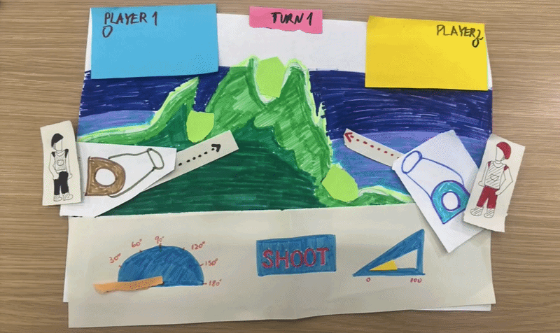
  </a>
</p>

<p align="center"><em>Cover Preview. HOT CANNONS main gameplay snapshot. Click the image to open it at full size.</em></p>

**Demo Video:** [Open attached gameplay demo](https://github.com/user-attachments/assets/d481b491-efc3-44cc-9b79-187f7e841b5e)

---

## Table of Contents

- [Development Team](#development-team)
- [Project Overview](#project-overview)
- [1. Introduction](#1-introduction)
- [2. Requirements](#2-requirements)
- [3. Design](#3-design)
- [4. Implementation](#4-implementation)
- [5. Evaluation](#5-evaluation)
- [6. Process](#6-process)
- [7. Sustainability, Ethics and Accessibility](#7-sustainability-ethics-and-accessibility)
- [8. Conclusion](#8-conclusion)
- [9. Contribution Statement](#9-contribution-statement)
- [10. AI Statement](#10-ai-statement)
- [Appendix](#appendix)
- [References](#references)

---

## Quick Index

### Section Index

- [Development Team](#development-team)
- [Project Overview](#project-overview)
- [1. Introduction](#1-introduction)
- [2. Requirements](#2-requirements)
  - [2.1 Ideation Process](#21-ideation-process)
  - [2.2 Early Stage Design](#22-early-stage-design)
  - [2.3 Stakeholder Identification: The Onion Model](#23-stakeholder-identification-the-onion-model)
  - [2.4 Epics and User Stories](#24-epics-and-user-stories)
  - [2.5 Use Case Diagram](#25-use-case-diagram)
  - [2.6 Use Case Specifications](#26-use-case-specifications)
- [3. Design](#3-design)
  - [3.1 Design Evolution](#31-design-evolution)
  - [3.2 Key Differences and Architectural Improvements](#32-key-differences-and-architectural-improvements)
  - [3.3 How Our Design Follows Object-Oriented Design Principles](#33-how-our-design-follows-object-oriented-design-principles)
  - [3.4 Class Diagrams](#34-class-diagrams)
  - [3.5 Behavior Diagrams](#35-behavior-diagrams)
- [4. Implementation](#4-implementation)
  - [4.1 Destructible Terrain](#41-destructible-terrain)
  - [4.2 AI-Controlled Player](#42-ai-controlled-player)
- [5. Evaluation](#5-evaluation)
  - [5.1 Qualitative: Think Aloud](#51-qualitative-think-aloud)
  - [5.2 Quantitative: NASA Task Load Index (NASA-TLX) and System Usability Survey (SUS)](#52-quantitative-nasa-task-load-index-nasa-tlx-and-system-usability-survey-sus)
  - [5.3 Code Testing](#53-Code-Testing)
- [6. Process](#6-process)
  - [6.1 Role Allocation Across the Entire Project](#61-role-allocation-across-the-entire-project)
  - [6.2 Responsibility Management and Flexible Collaboration](#62-responsibility-management-and-flexible-collaboration)
  - [6.3 Shared Development Approach](#63-shared-development-approach)
  - [6.4 Project Management Tools Usage and Challenges](#64-project-management-tools-usage-and-challenges)
  - [6.5 Improvements in Project Management Process](#65-improvements-in-project-management-process)
  - [6.6 Improvements in Version Control and Development Process](#66-improvements-in-version-control-and-development-process)
- [7. Sustainability, Ethics and Accessibility](#7-sustainability-ethics-and-accessibility)
- [8. Conclusion](#8-conclusion)
- [9. Contribution Statement](#9-contribution-statement)
- [10. AI Statement](#10-ai-statement)
  - [10.1 AI for Learning](#101-ai-for-learning)
  - [10.2 AI for Asset Generation](#102-ai-for-asset-generation)

### Figure Index

- [Figure 1. Start page prototype](#fig-1)
- [Figure 2. Weapon selection prototype](#fig-2)
- [Figure 3. Main game prototype](#fig-3)
- [Figure 4. Onion Model stakeholder analysis](#fig-4)
- [Figure 5. Use case diagram for HOT CANNONS](#fig-5)
- [Figure 6. Class diagram](#fig-6)
- [Figure 7. Overview behavior diagram](#fig-7)
- [Figure 8. Detailed behavior diagram](#fig-8)
- [Figure 9. Terrain destruction, phase 1](#fig-9)
- [Figure 10. Terrain destruction, phase 2](#fig-10)
- [Figure 11. Terrain destruction, phase 3](#fig-11)
- [Figure 12. Terrain destruction, phase 4](#fig-12)
- [Figure 13. AI-player self-hit caused by jitter](#fig-13)
- [Figure 14. NASA-TLX boxplot](#fig-14)
- [Figure 15. NASA-TLX radar chart](#fig-15)
- [Figure 16. Team meeting records](#fig-16)
- [Figure 17. In-person collaborative development session](#fig-17)
- [Figure 18. Gantt chart schedule](#fig-18)
- [Figure 19. Kanban board](#fig-19)
- [Figure 20. Daily meeting agenda slide](#fig-20)
- [Figure 21. Outlook calendar coordination](#fig-21)
- [Figure 22. Revised Git merge process](#fig-22)
- [Figure 23. Brainstorming with sticky notes](#fig-23)
- [Figure 24. Sustainability impact chain](#fig-24)
- [Figure 25. AI prompt used for learning](#fig-25)
- [Figure 26. Hand-drawn concepts and AI-generated colourisations](#fig-26)

### Appendix Index

- [Appendix A. Weapon Gallery](#appendix-a-weapon-gallery)
- [Appendix B. Motion Asset Gallery](#appendix-b-motion-asset-gallery)

> Reading note: all embedded figures and GIFs are clickable for full-size viewing.

---

## Development Team

<p align="center">
  <a href="./images/team-collage.png">
    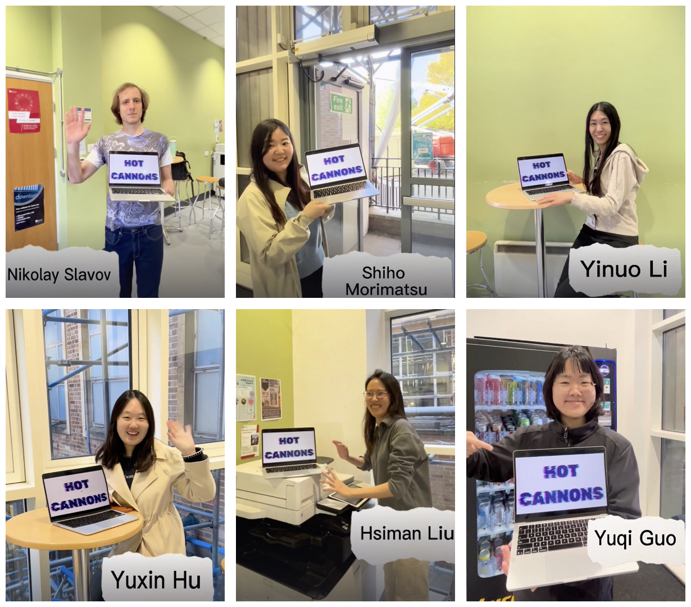
  </a>
</p>

| Name | Email | GitHub |
|---|---|---|
| Nikolay Slavov | ji25441@bristol.ac.uk | `Dozuu-Touryou` |
| Shiho Morimatsu | rz25939@bristol.ac.uk | `shiho1008` |
| Yinuo Li | cs25733@bristol.ac.uk | `Liyinuo123` |
| Yuxin Hu | fx25208@bristol.ac.uk | `Cindy04869` |
| Hsin-Man Liu | cw25376@bristol.ac.uk | `hsinmanliu` |
| Yuqi Guo | rr24582@bristol.ac.uk | `Allison-coder` |

---

## Project Overview

HOT CANNONS is a single-player, turn-based artillery game inspired by Pocket Tanks, featuring a wide variety of random events that make each match unpredictable and dynamic. These events include earthquakes as well as weather effects such as rain of varying intensity and strong winds that affect projectile behavior. In addition, players can pick various types of shots in a shop screen, combining weapons adapted from Pocket Tanks with newly designed ones. This system encourages players to plan ahead and customize their loadouts according to their preferred playstyle. On each turn, players must carefully choose which shot to use based on terrain conditions, available resources, and their overall strategy. The combination of strategic decision-making and unpredictable events ensures that no two matches play out the same, encouraging players to return to the game repeatedly. Overall, HOT CANNONS delivers a strategic and highly replayable game experience by blending classic artillery mechanics with dynamic environments, player choice, and elements of randomness.

---

## 1. Introduction

<p align="center">
  <a href="./images/hot_cannons_mood_board.png">
    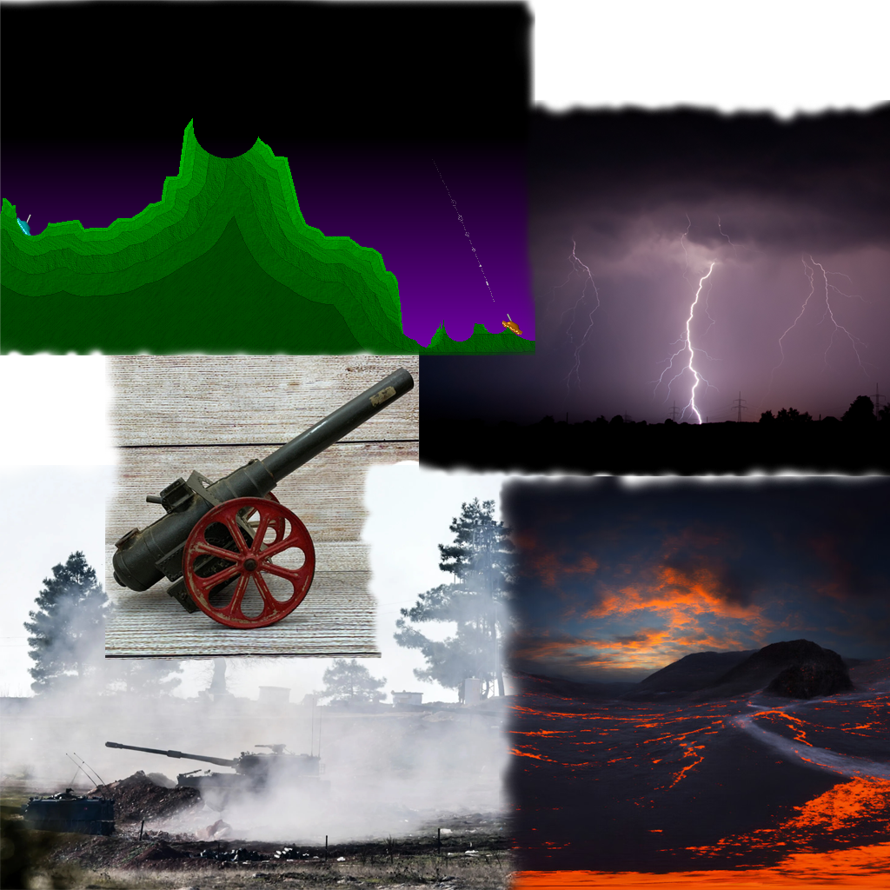
  </a>
</p>

<p align="center"><em>Opening Poster. From classic artillery roots to unstable battlefields: the visual pitch behind HOT CANNONS.</em></p>

| Pocket Tanks DNA | Our Twist | Design Direction |
|---|---|---|
| Turn-based artillery, destructible terrain, and weapon variety gave us a technically feasible but strategically rich foundation. | Instead of keeping matches stable and predictable, HOT CANNONS introduces random environmental and gameplay events that disrupt player plans. | We designed the game around replayability: every match asks players to adapt loadouts, aim, and tactics to changing terrain, visibility, and events. |

HOT CANNONS reimagines the core appeal of classic artillery games as a more volatile, more tactical, and more expressive competitive experience. The original inspiration came from *Pocket Tanks*, which immediately stood out in our early research because its turn-based artillery combat, destructible terrain, and varied projectile behaviour offered a clear technical foundation while still leaving room for meaningful extension. From the beginning, our team was drawn not just to the simplicity of firing a shot across a 2D battlefield, but to the strategic tension created by terrain deformation, timing, and weapon choice.

What pushed the idea forward was the decision to treat unpredictability as the game’s main twist rather than a minor add-on. In our early ideation, we explored ways to transform a familiar artillery formula through random environmental and gameplay events: sudden weather changes, altered visibility, teleports, extra turns, and other disruptions that force players to adapt instead of relying on a single repeated strategy. This direction helped shape HOT CANNONS into more than a homage to Pocket Tanks. It became a game about reading unstable conditions, planning around uncertainty, and choosing weapons not only for damage output but also for situational advantage.

The result is a single-player, turn-based artillery game in which every round has the potential to evolve differently. Players assemble a loadout in the weapon shop, select between difficulty modes, and then fight across destructible terrain while responding to dynamic events that can change the flow of battle at any moment. By combining accessible core mechanics with randomised match conditions, HOT CANNONS aims to be immediately understandable, strategically rich, and highly replayable.

## 2. Requirements

### 2.1 Ideation Process

During the early stages of the ideation process, our team began with a brainstorming session, where each member used Google Docs to independently research and record several game concepts that they were interested in developing. These initial ideas covered a range of gameplay styles, including action-based, strategy-focused, and arcade-inspired games.

After discussing the feasibility and development complexity of each idea, we conducted a quick team vote and decided to take Pocket Tanks as our main gameplay reference. Its turn based artillery combat, projectile physics, and destructible environment mechanics provided a strong and achievable foundation for our project, while also offering clear opportunities for further innovation.

We then went about creating paper prototypes of our initial concept in order to flesh out the specific gameplay details. This proved especially helpful considering the complexity of the concept, as it enabled us to better define the gameplay loop, player interaction flow, and core mechanics at an early stage. Paper prototyping was also valuable in improving communication within the team, particularly in helping all members visualise the turn-based combat flow, aiming controls, and overall user experience before moving into implementation.

<a id="fig-1"></a>
<p align="center">
  <a href="./video/startgame.gif">
    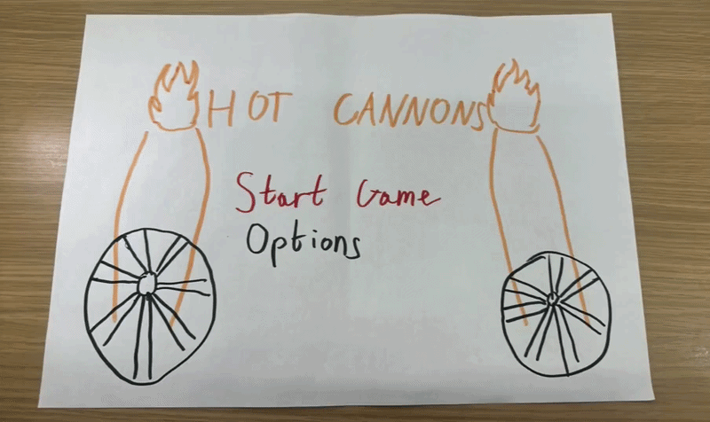
  </a>
</p>
<p align="center"><em>Figure 1. Start page prototype.</em></p>

<a id="fig-2"></a>
<p align="center">
  <a href="./video/weaponshop.gif">
    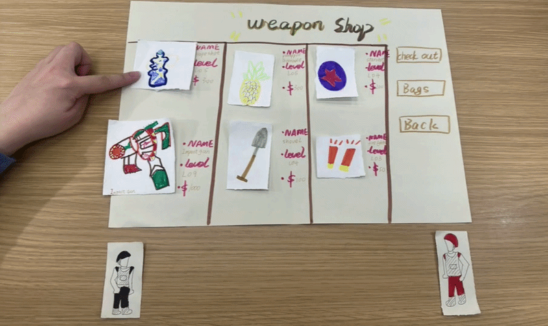
  </a>
</p>
<p align="center"><em>Figure 2. Weapon selection prototype.</em></p>

<a id="fig-3"></a>
<p align="center">
  <a href="./video/maingame.gif">
    
  </a>
</p>
<p align="center"><em>Figure 3. Main game demo prototype.</em></p>

### 2.2 Early Stage Design

Having selected Pocket Tanks as our main reference, we then identified several key design decisions to differentiate our game from the original concept.

1. Destructible terrain allows the battlefield to change dynamically after each explosion, adding greater strategic depth.
2. AI controlled opponent mode planned to support future single player gameplay and extend system usability.
3. Weapon shop and enhanced weapon system enables players to select a limited loadout before each match, increasing tactical planning and gameplay variety.
4. Easy and Hard modes introduced to support different player skill levels, with Easy Mode providing trajectory guidance and Hard Mode increasing challenge.
5. Random events in Hard Mode includes rain, wind, and earthquake effects to improve replayability and require players to adapt their shooting strategy.

These early design decisions helped us expand the original artillery concept into a more strategic and replayable game system.

### 2.3 Stakeholder Identification: The Onion Model

To support our requirements planning, we applied The Onion Model to identify the key stakeholders involved in or affected by the development of HOT CANNONS (Figure 4). This helped us visualise not only the direct users of the system, but also the wider technical, academic, and deployment context surrounding the game.

At the core layer, the system itself is HOT CANNONS. The containing system includes the immediate users, namely players and testers, whose feedback directly influenced usability, balance, and overall gameplay experience.

The wider environment includes the development team, instructors and assessors, and the reference game Pocket Tanks. Following Alexander’s concept of surrogate roles, instructors acted as representative stakeholders by providing feedback on software engineering quality, usability, and academic expectations.

The external environment includes the deployment platform (GitHub Pages), the broader user community, and course requirements, which together reflect the wider context in which the system is developed, deployed, and evaluated.

This stakeholder analysis ensured that our requirements considered not only gameplay needs, but also technical feasibility, user feedback, and academic constraints.

<a id="fig-4"></a>
<p align="center">
  <a href="./images/onion%20model.png">
    
  </a>
</p>
<p align="center"><em>Figure 4. Onion Model stakeholder analysis.</em></p>

### 2.4 Epics and User Stories

Based on the stakeholders identified through the Onion Model (Figure 4), we translated stakeholder needs into a set of Epics and User Stories to guide system development and prioritise core features.

The main epics identified for HOT CANNONS were:

- Core artillery gameplay and destructible terrain
- Weapon shop and loadout system
- Difficulty modes and accessibility
- Dynamic events and replayability
- AI controlled single player mode
- User interface and user experience

These epics were directly informed by the needs of players, testers, the wider user community, and course requirements identified in the stakeholder analysis.

From these epics, we derived User Stories using the standard format:

> As a [user], I want [feature], so that [value].

Examples of key user stories include:

- As a player, I want destructible terrain so that each shot changes the battlefield and requires strategic decision-making.
- As a player, I want to select weapons before the match so that I can plan my gameplay strategy in advance.
- As a new player, I want tutorial pop ups so that I can understand how to aim and fire correctly.
- As a new player, I want an Easy Mode with trajectory guidance so that I can quickly learn the controls and gameplay mechanics.
- As an experienced player, I want Hard Mode random events so that each match feels more challenging and unpredictable.
- As a colourblind player, I want distinguishable UI colours so that game information remains clear.
- As a single player user, I want to play against an AI opponent so that I can enjoy the game without requiring a second player.

These user stories helped ensure that our system requirements remained closely aligned with stakeholder needs and supported both gameplay quality and accessibility.

### 2.5 Use Case Diagram

To ensure the entire team maintained a shared understanding of the system-user interactions and the overall gameplay flow, we developed a Use Case Diagram as part of our requirements engineering process.

The diagram was particularly useful in modelling the main gameplay flow of HOT CANNONS, including game setup, difficulty selection, weapon selection, turn based shooting, terrain updates, and match progression.

This enabled the team to maintain a clear high-level view of the system behaviour and better understand the relationships between the core gameplay features and planned user interactions.

<a id="fig-5"></a>
<p align="center">
  <a href="./images/use-case-diagram.png">
    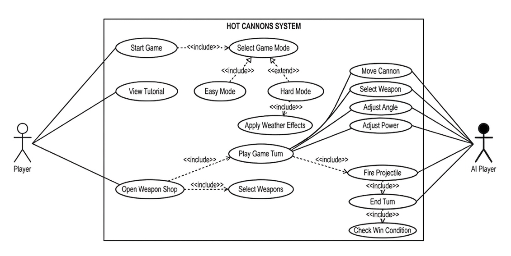
  </a>
</p>
<p align="center"><em>Figure 5. Use case diagram for HOT CANNONS.</em></p>

### 2.6 Use Case Specifications

**Easy Mode**  
Players are given a visible trajectory preview to support aiming and power adjustment.

**Hard Mode**  
Players do not receive trajectory guidance. During the five-round match, random environmental effects such as wind, rain, and earthquakes may occur and interfere with shooting. The AI opponent also performs with stronger and more accurate shots.

<table style="border-collapse: collapse; width: 100%; font-family: Arial, sans-serif;">
  <tr style="background-color:#2c3e50; color:white;">
    <th style="padding:10px; border:1px solid #ddd;">Use-Case Section</th>
    <th style="padding:10px; border:1px solid #ddd;">Easy Mode</th>
    <th style="padding:10px; border:1px solid #ddd;">Hard Mode</th>
  </tr>
  <tr style="background-color:#ecf0f1;">
    <td><b>Description</b></td>
    <td>A match flow in which players can learn and play the game with visual aiming support.</td>
    <td>A more challenging match flow in which aiming support is removed and environmental effects increase uncertainty.</td>
  </tr>
  <tr>
    <td><b>Basic Flow</b></td>
    <td>Start the game, select a game mode, choose Easy Mode, select weapons in the shop, and play turn by turn until a winner is determined.</td>
    <td>Start the game, select a game mode, choose Hard Mode, select weapons in the shop, and play turn by turn while dealing with random environmental interference until a winner is determined.</td>
  </tr>
  <tr style="background-color:#ecf0f1;">
    <td>1</td>
    <td>Player starts the game and may view the tutorial before entering the match.</td>
    <td>Player starts the game and may view the tutorial before entering the match.</td>
  </tr>
  <tr>
    <td>2</td>
    <td>Player selects the game mode and proceeds to the weapon shop to choose a loadout.</td>
    <td>Player selects the game mode and proceeds to the weapon shop to choose a loadout.</td>
  </tr>
  <tr style="background-color:#ecf0f1;">
    <td>3</td>
    <td>During a turn, the player may move the cannon, select a weapon, and adjust angle and power with the help of a trajectory preview.</td>
    <td>During a turn, the player may move the cannon, select a weapon, and adjust angle and power without trajectory preview.</td>
  </tr>
  <tr>
    <td>4</td>
    <td>Player fires a projectile, the shot is resolved, terrain is updated, and the turn ends.</td>
    <td>Player fires a projectile, but environmental effects may alter projectile behaviour before the turn ends.</td>
  </tr>
  <tr style="background-color:#ecf0f1;">
    <td>5</td>
    <td>The next player or AI takes a turn. This continues until the win condition is met.</td>
    <td>The next player or AI takes a turn with higher accuracy and difficulty.</td>
  </tr>
  <tr>
    <td><b>Alternative Flow</b></td>
    <td>A player may miss due to incorrect angle or power selection, but trajectory preview helps adjustment.</td>
    <td>A player may miss due to lack of guidance or environmental interference.</td>
  </tr>
  <tr style="background-color:#ecf0f1;">
    <td>1</td>
    <td>An explosion modifies the terrain and affects later shots.</td>
    <td>Terrain changes plus environmental effects increase difficulty.</td>
  </tr>
  <tr>
    <td>2</td>
    <td>AI takes turns using the same logic as the player.</td>
    <td>AI uses more accurate firing behaviour.</td>
  </tr>
  <tr style="background-color:#ecf0f1;">
    <td>3</td>
    <td>Game continues until a player’s health reaches zero.</td>
    <td>Game continues with ongoing random disruptions.</td>
  </tr>
  <tr>
    <td><b>End Condition</b></td>
    <td>Game ends and results are displayed.</td>
    <td>Game ends after a more difficult match and results are displayed.</td>
  </tr>
</table>

## 3. Design

### 3.1 Design Evolution

In the early stages, our primary goal was to establish a functional prototype centered on core mechanics. However, as the project's complexity grew, we encountered significant engineering bottlenecks. The centralized `main` file became excessively long, making it difficult to coordinate and manage. Since each team member was responsible for developing different parts but all had to modify the same core file, the development process was plagued by frequent and complex merge conflicts. This initial structure not only slowed down progress but also increased the risk of accidental logic regressions, where one person's changes would inadvertently overwrite or break another’s code. To facilitate safer parallel development and better scalability, we moved from a centralized model to a Decentralized State Pattern.

| Phase | Conceptual Architecture Diagram | Architectural Logic & Evolution |
| :--- | :--- | :--- |
| **Initial Design** | <a href="./images/stage1.png">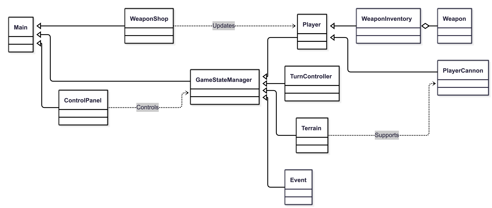</a> | **Centralized Design:** Initially, a central `GameStateManager` coordinated all aspects (terrain, turns, players, UI). This was effective for prototyping but led to a "ripple effect" where UI changes could inadvertently break the physics engine, making the codebase hard to maintain. |
| **↓** | **Refactoring Path** | To resolve these dependencies, we transitioned to a modular gameplay layer guided by the State Pattern. |
| **Final Design** | <a href="./images/stage3.png">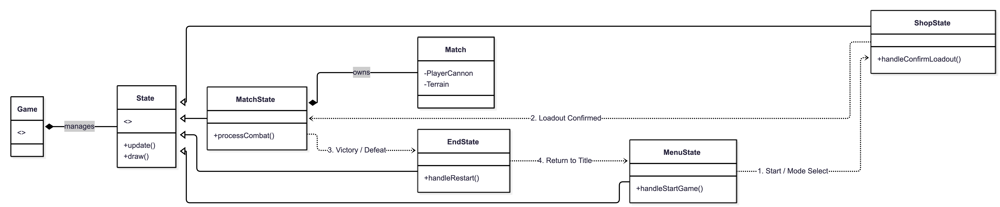</a> | **Decentralized Design:** The final architecture isolates the application lifecycle into specific States (**Menu**, **Shop**, **Match**, **End**). This ensures that heavy simulation logic is only resident in memory when necessary, keeping each phase isolated and maintainable. |

### 3.2 Key Differences and Architectural Improvements

By comparing the initial and final designs, several critical improvements in software engineering quality were achieved:

- **State-Driven Lifecycle & Memory Optimization**: Unlike the initial design where all logic was resident simultaneously, the final system uses the `Game` class to delegate behavior to the current `State`. This ensures that heavy simulation logic (e.g., the terrain engine) is only instantiated during an active match and disposed of upon returning to the menu, significantly optimizing memory performance.
- **Modular Coordination in `Match` Class**: The core gameplay logic is now concentrated in the `Match` class, acting as a dedicated coordinator. Instead of a monolithic loop, it collaborates with specialized classes (`TurnController`, `ScoreBoard`, `ControlPanel`, `Terrain`). This modularity prevents logic "leakage" between domains, improving readability and allowing features to be extended independently.
- **Polymorphic Weaponry System**: We utilized **Polymorphism** to handle the weapon inventory. All weapons inherit from `AbstractWeapon`, providing extension points for projectile behavior and rendering. Concrete classes (e.g., `Grapeshot`, `Lazershot`, `Submarinshot`) override these methods. This means the combat engine requires no hardcoded logic for specific weapons; behavior is delegated to the classes themselves, allowing for easy addition of new weapons without modifying the core firing logic.
- **Encapsulation of Custom Behavior**: Overall, the refactor achieved a clear separation of concerns: state management handles progression between screens, the `Match` system coordinates the battle environment, and weapon subclasses encapsulate custom combat physics.

### 3.3 How Our Design Follows Object-Oriented Design Principles

| OOD Feature | Examples in Our Project |
|---|---|
| **Abstraction** | `State` provides the common lifecycle interface (`updateState()`, `drawState()`), while `AbstractWeapon` defines shared weapon behaviour such as `drawProjectile()`, `onImpact()`, and `drawExplosion()`. |
| **Inheritance** | `MenuState`, `ShopState`, `MatchState`, and `EndState` inherit from `State`; weapon classes such as `Grapeshot`, `Lazershot`, and `Submarinshot` inherit from `AbstractWeapon`. |
| **Polymorphism** | The combat system can call `beforeProjectileStep()`, `onImpact()`, or `drawExplosion()` on any weapon, and each weapon class can provide its own implementation. |
| **Composition** | `Match` is composed of `Terrain`, `TurnController`, `ScoreBoard`, `ControlPanel`, `TrajectoryPreview`, weather systems, and active gameplay objects such as `Projectile` and `Explosion`. |
| **Encapsulation** | Classes use private fields such as `#players`, `#currentShot`, `#position`, and `#weaponLoadout`, with access managed through methods like `fireCurrentWeapon()` and `advancePhase()`. |

### 3.4 Class Diagrams

To illustrate the structural growth and refactoring of the system, we have documented the class diagrams across three key development stages. This progression reflects our iterative transition and demonstrates how our understanding of software architecture and effective teamwork evolved throughout the project.

| Stage | Diagram | Description & Key Refinements |
| :--- | :--- | :--- |
| Stage 1: Initial Prototype | <a href="./images/stage1.svg">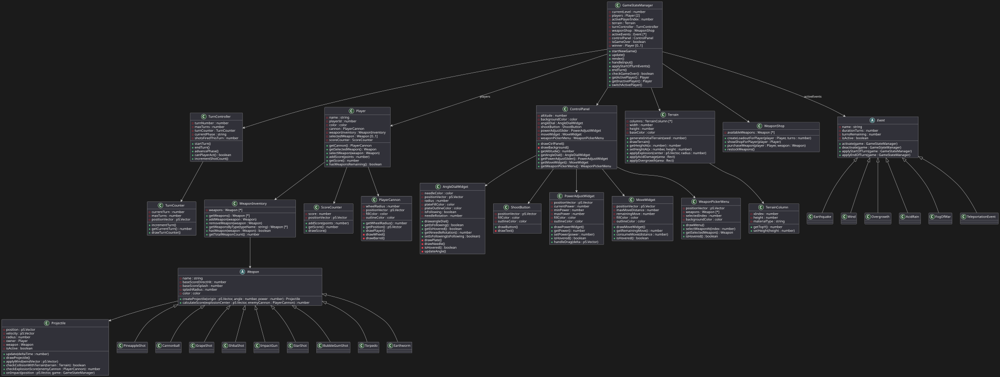</a> | **The "God Object" Phase [[1]](#ref1):** In Stage 1, the `GameStateManager` was a "God Object" that tried to do everything, managing players, generating terrain, and controlling the UI all at once. This made the code risky to change. |
| Stage 2: Refactored Prototype | <a href="./images/stage2.svg">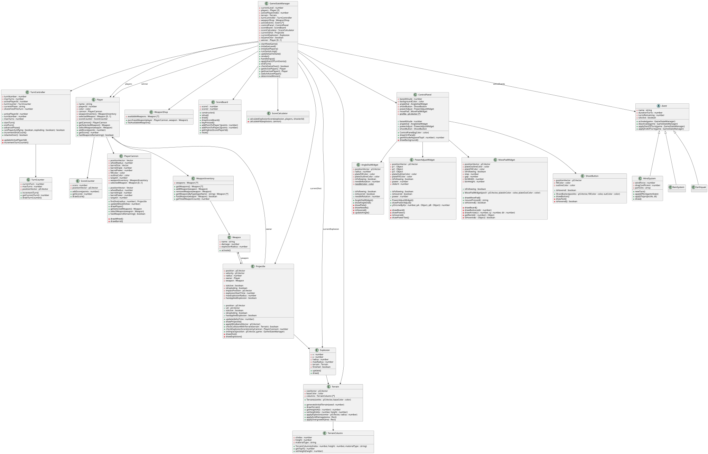</a> | **Decoupling Responsibilities:** We began breaking down the monolithic controller. Logic started shifting towards specialized classes to improve maintainability, though the game flow was still tightly coupled. |
| Stage 3: Final Implementation | <a href="./images/stage3.svg"></a> | **Modular & State-Driven:** As the game grew, we refined these relationships. For example, while UI widgets like `AngleDialWidget` and `PowerAdjustWidget` existed from the start, they were moved in Stage 3 to be part of a dedicated `ControlPanel` inside the `Match` class. |

> **Interactive View:** For more details, please open the [homework page](https://github.com/UoB-COMSM0166/2026-group-17/tree/main/homework).


```mermaid
classDiagram
direction TB

class Game
class Effects

class State
class MenuState
class ShopState
class MatchState
class EndState

class StartMenu
class WeaponShop
class AIController

class Match
class PlayerCannon
class Projectile
class Explosion
class PoisonCloud
class ShibaImpactEffect
class FloatingScore

class ControlPanel
class WeaponInventory
class AngleDialWidget
class ShootButton
class PowerAdjustWidget
class MovePadWidget
class TrajectoryPreview

class TurnController
class TurnCounter
class ScoreBoard
class ScoreCalculator

class Terrain
class TerrainColumn

class WindSystem
class RainSystem
class EarthquakeSystem

class AbstractWeapon
class CannonBall
class Bubblegumshot
class Earthworm
class Grapeshot
class ImpactGun
class Lazershot
class Pineappleshot
class Shibashot
class Starshot
class Submarinshot

Game --> Effects : owns
Game --> State : currentState
State <|-- MenuState
State <|-- ShopState
State <|-- MatchState
State <|-- EndState

MenuState --> StartMenu : uses
MenuState --> ShopState : switches to

ShopState --> WeaponShop : owns
ShopState --> AIController : owns
ShopState --> MatchState : switches to

MatchState --> Match : owns
MatchState --> EndState : switches to
MatchState --> Effects : uses shake

EndState --> Game : restart

WeaponShop --> AbstractWeapon : displays/selects
WeaponShop --> AIController : AI shop pick

Match --> PlayerCannon : manages 2
Match --> Terrain : owns
Match --> ControlPanel : owns
Match --> TurnController : owns
Match --> TurnCounter : owns
Match --> ScoreBoard : owns
Match --> ScoreCalculator : owns
Match --> TrajectoryPreview : owns
Match --> WindSystem : owns
Match --> RainSystem : owns
Match --> EarthquakeSystem : owns
Match --> AIController : uses
Match --> Projectile : currentShot / secondaryShots
Match --> Explosion : currentExplosions
Match --> PoisonCloud : spawns
Match --> ShibaImpactEffect : spawns
Match --> FloatingScore : spawns

ControlPanel --> AngleDialWidget : owns
ControlPanel --> ShootButton : owns
ControlPanel --> PowerAdjustWidget : owns
ControlPanel --> MovePadWidget : owns
ControlPanel --> WeaponInventory : owns

WeaponInventory --> AbstractWeapon : displays
TrajectoryPreview --> AbstractWeapon : reads weapon behavior
TrajectoryPreview --> Terrain : simulates against
TrajectoryPreview --> PlayerCannon : reads launch state

Terrain --> ControlPanel : queries altitude
Terrain *-- TerrainColumn : contains

TurnController --> PlayerCannon : checks canAct
ScoreCalculator --> PlayerCannon : scores hits
ScoreBoard --> PlayerCannon : displays scores

PlayerCannon --> Projectile : fires
PlayerCannon o-- AbstractWeapon : weaponLoadout
Projectile --> AbstractWeapon : weapon behavior
Explosion --> AbstractWeapon : custom drawExplosion

WindSystem --> Projectile : applyTo
RainSystem --> Projectile : applyTo
EarthquakeSystem --> Projectile : applyTo

AbstractWeapon <|-- CannonBall
AbstractWeapon <|-- Bubblegumshot
AbstractWeapon <|-- Earthworm
AbstractWeapon <|-- Grapeshot
AbstractWeapon <|-- ImpactGun
AbstractWeapon <|-- Lazershot
AbstractWeapon <|-- Pineappleshot
AbstractWeapon <|-- Shibashot
AbstractWeapon <|-- Starshot
AbstractWeapon <|-- Submarinshot

AbstractWeapon --> Match : onImpact()
AbstractWeapon --> Explosion : drawExplosion()
AbstractWeapon --> Projectile : beforeProjectileStep()
```

<a id="fig-6"></a>
<p align="center"><em>Figure 6. Class diagram.</em></p>

### 3.5 Behavior Diagrams

While the Class Diagrams define the static structure, the following behavioral diagrams illustrate how our system interact with actors in real-time.

##### Overview Behavior Diagram

The first diagram provides a high-level overview of the entire game lifecycle. It maps the journey from the initial **Menu selection** through the **Weapon Shop** and into the active **Match**.

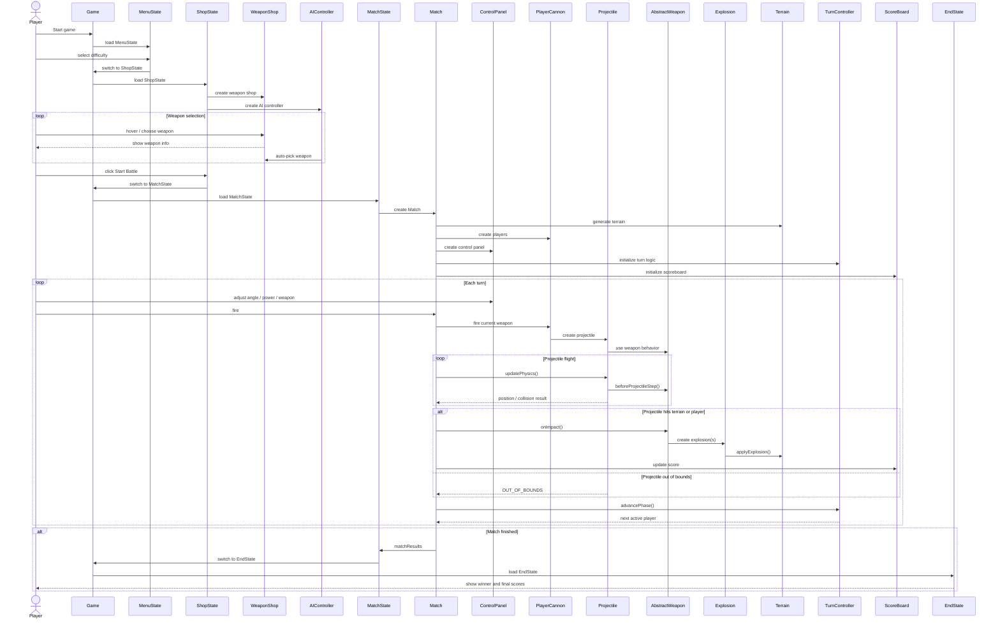
```mermaid
sequenceDiagram
    actor P as Player
    participant G as Game
    participant MS as MenuState
    participant SS as ShopState
    participant WS as WeaponShop
    participant AI as AIController
    participant MTS as MatchState
    participant M as Match
    participant CP as ControlPanel
    participant PC as PlayerCannon
    participant PR as Projectile
    participant AW as AbstractWeapon
    participant EX as Explosion
    participant T as Terrain
    participant TC as TurnController
    participant SB as ScoreBoard
    participant ES as EndState

    P->>G: Start game
    G->>MS: load MenuState
    P->>MS: select difficulty
    MS->>G: switch to ShopState

    G->>SS: load ShopState
    SS->>WS: create weapon shop
    SS->>AI: create AI controller

    loop Weapon selection
        P->>WS: hover / choose weapon
        WS-->>P: show weapon info
        AI->>WS: auto-pick weapon
    end

    P->>SS: click Start Battle
    SS->>G: switch to MatchState

    G->>MTS: load MatchState
    MTS->>M: create Match
    M->>T: generate terrain
    M->>PC: create players
    M->>CP: create control panel
    M->>TC: initialize turn logic
    M->>SB: initialize scoreboard

    loop Each turn
        P->>CP: adjust angle / power / weapon
        P->>M: fire
        M->>PC: fire current weapon
        PC->>PR: create projectile
        PR->>AW: use weapon behavior

        loop Projectile flight
            M->>PR: updatePhysics()
            PR->>AW: beforeProjectileStep()
            PR-->>M: position / collision result
        end

        alt Projectile hits terrain or player
            M->>AW: onImpact()
            AW->>EX: create explosion(s)
            EX->>T: applyExplosion()
            M->>SB: update score
        else Projectile out of bounds
            PR-->>M: OUT_OF_BOUNDS
        end

        M->>TC: advancePhase()
        TC-->>M: next active player
    end

    alt Match finished
        M->>MTS: matchResults
        MTS->>G: switch to EndState
        G->>ES: load EndState
        ES-->>P: show winner and final scores
    end
```

<a id="fig-7"></a>
<p align="center"><em>Figure 7. Overview behavior diagram.</em></p>

##### Detailed Behavior Diagram

The second diagram is a detailed Behavior Diagram, that focuses on the "Heart" of our game: battle execution and match completion. This diagram highlights the dynamic orchestration of objects during a single turn. It traces how a player's fire command triggers a chain reaction.

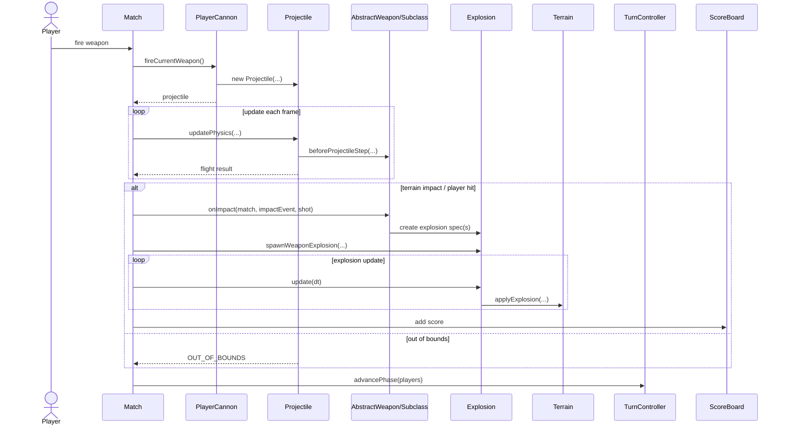
```mermaid
sequenceDiagram
    actor Player
    participant Match
    participant PlayerCannon
    participant Projectile
    participant Weapon as AbstractWeapon/Subclass
    participant Explosion
    participant Terrain
    participant TurnController
    participant ScoreBoard

    Player->>Match: fire weapon
    Match->>PlayerCannon: fireCurrentWeapon()
    PlayerCannon->>Projectile: new Projectile(...)
    PlayerCannon-->>Match: projectile

    loop update each frame
        Match->>Projectile: updatePhysics(...)
        Projectile->>Weapon: beforeProjectileStep(...)
        Projectile-->>Match: flight result
    end

    alt terrain impact / player hit
        Match->>Weapon: onImpact(match, impactEvent, shot)
        Weapon->>Explosion: create explosion spec(s)
        Match->>Explosion: spawnWeaponExplosion(...)
        loop explosion update
            Match->>Explosion: update(dt)
            Explosion->>Terrain: applyExplosion(...)
        end
        Match->>ScoreBoard: add score
    else out of bounds
        Projectile-->>Match: OUT_OF_BOUNDS
    end

    Match->>TurnController: advancePhase(players)
```

<a id="fig-8"></a>
<p align="center"><em>Figure 8. Detailed behavior diagram.</em></p>

## 4. Implementation

### 4.1 Destructible Terrain

Terrain was implemented using composition where a `Terrain` class manages an array of `TerrainColumn` objects.

Each column stored its top position, with y-coordinates generated randomly within a constrained range. Rendering was handled by a custom vertex-based shape. While circular explosions could push down those y-coordinates using the Pythagorean theorem, this height-map approach inherently prevented the creation of overhangs.

<a id="fig-9"></a>
<p align="center">
  <a href="./images/Terrain_destruction_v1.gif">
    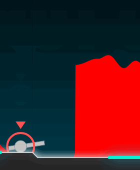
  </a>
</p>
<p align="center"><em>Figure 9. Phase 1: terrain above destroyed terrain disappears completely.</em></p>

This prompted a rework of the terrain logic. Each `TerrainColumn` was updated to store a pixels array. A `removeExplodedPixels()` method that utilized `p5.dist()` was implemented to find and preserve only pixels outside of the explosion range using the `Array.prototype.filter()` method.

After an explosion, if a column wasn't completely destroyed, it would end up with 1 or more disconnected pairs of pixels' y-coordinates which we decided to call *spans*. Rendering then shifted from a single custom shape to individual `p5.line()` calls for each span which effectively enabled static overhangs.

<a id="fig-10"></a>
<p align="center">
  <a href="./images/Terrain_destruction_v2.gif">
    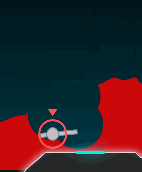
  </a>
</p>
<p align="center"><em>Figure 10. Phase 2: static overhanging terrain forms when terrain above is destroyed.</em></p>

The next phase focused on dynamic settling for floating terrain chunks. A `startSettling()` method and a `targetSpans` array field were added, to calculate and store the settled positions of each span. An `updateAnimation()` method incremented a `settleProgress` field using `p5.deltaTime`. Then, `p5.lerp()` was used to interpolate between the spans and targetSpans positions, initially.

This was an oversight fixed by adding a `startSpans` field to maintain a fixed reference point in the `lerp()` calls. Once `settleProgress` exceeded 1.0, columns snapped to their final positions and `rebuildPixelsFromSpans()` updated underlying pixel data. Thus, the initial terrain settling behaviour was completed.

<a id="fig-11"></a>
<p align="center">
  <a href="./images/Terrain_destruction_v3.gif">
    
  </a>
</p>
<p align="center"><em>Figure 11. Phase 3: floating terrain gradually settles in a flabby manner.</em></p>

However, the `lerp()` logic caused uneven settling because spans moved at speeds proportional to their distance from the target solid ground position. To ensure chunks maintained shape during descent, the approach shifted to using constant velocity. By adding the product of `deltaTime` and a fixed speed scalar directly to the span coordinates, uniform motion across all columns was achieved.

<a id="fig-12"></a>
<p align="center">
  <a href="./images/Terrain_destruction_v4.gif">
    
  </a>
</p>
<p align="center"><em>Figure 12. Phase 4: floating terrain descends in a uniform manner.</em></p>

Finally, a bug was addressed where spans would sometimes settle 1 pixel above their target. This was resolved by merging post-settlement spans into a single consolidated span derived from the first and last element of the pixels array after `rebuildPixelsFromSpans()` completed. This finalised a system capable of convincing terrain destruction and settling.

### 4.2 AI-Controlled Player

During most of the development period, the game was a 2-player hot seater as the team was busy implementing other core features and fixing immersion-breaking bugs. This changed late into the project when the game felt stable enough to implement logic controlling player 2's actions.

AI behaviour was planned to be fairly simple, considering the late stage it was being introduced in. Therefore, the AI was programmed to pick weapons at random from the weapon shop screen, fire whatever the currently selected weapon is in its inventory and be unable to use the limited movement feature.

In terms of its implementation in the code, the AI works as a finite-state machine:

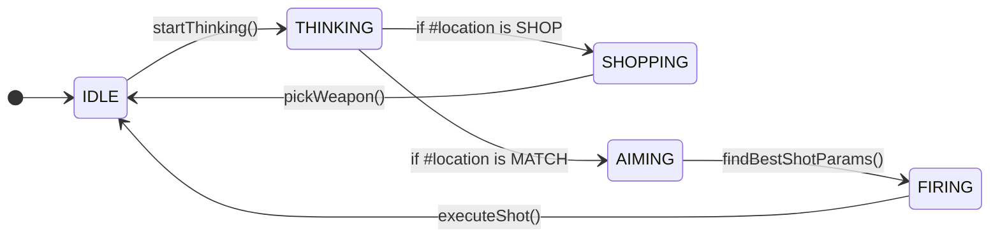
```mermaid
stateDiagram-v2
    direction LR

    [*] --> IDLE
    IDLE --> THINKING : startThinking()
    
    THINKING --> SHOPPING : if #location is SHOP
    THINKING --> AIMING : if #location is MATCH
    
    SHOPPING --> IDLE : pickWeapon()
    AIMING --> FIRING : findBestShotParams()
    FIRING --> IDLE : executeShot()
```

An `AIController` object is first instantiated in the `ShopState` class. Its `#location` field is set to *SHOP* and it is passed to the `WeaponShop` class's `update()` method which calls the `AIController`'s `startThinking()` method each time the current player in the shop is player 2 and also calls the `updateAI()` method passing it a callback to the `pickRandomWeapon()` method.

After all weapons have been picked and the player issues the correct input a reference to the same `AIController` object is passed from `ShopState` to `MatchState` and then on to the `Match` class.

In the `Match` class, the AI's `#location` field is changed to *MATCH* and during turn transition, if the current player is player 2, then it's `startThinking()` method is called. In the *THINKING* state the `AIController`'s `drawThinkIndicator()` method is also called to render animated dots above the player 2's cannon.

To determine firing parameters, the AI tests trajectories across a range of angles (-95° to -179°) and power levels (0 - 100). Originally, it did this via a brute-force approach that caused a significant frame-rate stutter of up to 1 second.

That issue was solved by refactoring the search into a two-pass coarse-to-fine algortithm. By first identifying a candidate region with large steps and then refining the search in that specific area, we acheived a **91% reduction in iterations** while maintaining aiming accuracy. The resulting performance imact is virtually imperceptible.

**Trajectory Search Algorithm Comparison Matrix**

| Metric / Implementation | Original | Optimised |
|---|---|---|
| Search Strategy | Single high-res pass | Two-pass (Coarse → Fine) |
| Angle Step | 2° | 8° (Coarse) / 2° (Fine) |
| Power Step | 1.25 units | 40 units (Coarse) / 5 units (Fine) |
| Total Iterations | ≈3000 | ≈270 |
| Visualisation | <a href="./images/Wind_particles_stutter.gif"></a> | <a href="./images/Smoother_AI_aiming.gif">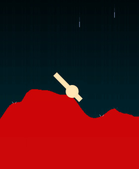</a> |

Another issue with AI behaviour was that it sometimes fired directy into nearby terrain as shown in Figure 13. This turned out to be a simpler issue to deal with. The `applyDifficultyJitter()` was modified to ensure random adjustments only changed the firing angle towards the vertical. This change was only applied to Hard mode as the original behaviour was considered appropriate in Easy mode.

<a id="fig-13"></a>
<p align="center">
  <a href="./images/Aiming_jitter_causing_self_hit.gif">
    
  </a>
</p>
<p align="center"><em>Figure 13. AI-player hitting itself due to random angle jitter outcome.</em></p>

## 5. Evaluation

### 5.1 Qualitative: Think Aloud

The following section presents the outcome of the first think aloud evaluation of our game.

At this stage the game represented a minimum viable product. The core gameplay loop allowing 2 players to take turns adjusting the angle and power with which they shoot, fire a single weapon, score hits and determine a winner as well as 1 event - wind - had all been implemented in their initial form.

**Users' observations:**

1. The most frequently requested improvement mentioned by three users was some sort of indicator for whose turn it is as at the time there was no such clue.
2. Two players wanted to know how many turns each match lasts.
3. Another player concern was the inability to precisely estimate the trajectory of shots before actually firing them.
4. One user thought it was unintuitive for shots flying off the left and right side of the screen to disappear and for those that fly off the top side to disappear and then fall down, eventually. They suggested adding some sort of barriers/invisible walls that make the shots explode or bounce on collision as a clearer indication of the outcome of the shots.
5. A suggested addition was to allow the Space key to fire shots, as well as allowing the arrow keys to move the current player's cannon.
6. A user complained about the situation in which cannons that are close to each other and both get hit by the same explosion. In this case, the shooting player both gains and loses points which the user found confusing.

**Analysis outcome:**

1. To keep the player updated on whose turn it currently is, it was decided to have colored text added below the round counter in addition to adding a colored halo-like indicator around the wheel of the current active player and a triangle symbol above the halo.
2. Extra text should be added to the round counter which should show the total number of rounds in the match, for example - Turn 3/5, rather than just Turn 3.
3. While it is part of the gameplay challenge for players to have to estimate the correct angle and power necessary to accurately hit the enemy player, an easy mode in which either the partial or full trajectory of a shot is shown before firing would be a good and useful addition, especially when taking into consideration the requirements of future evaluations.
4. The team disagreed about this critique constituting a real issue. The suggestion to add some sort of either visible or invisible walls at the left top and right edges of the screen which would cause shots to explode or bounce could be an interesting addition (especially the bouncing variation) but not one that the team would like to prioritise, currently.
5. Adding quality of life additions such as hotkeys for the shoot button and the move pad widget is a welcome and straightforward addition to implement.
6. This should be resolved by reducing the number of times cannons can move in a single match to somewhere in the range of 2 to 4 times. As each player cannon starts at a random position close to the opposite sides of the screen, making this change would make it much less likely for such a situation to occur. If it does occur, the original behaviour as described above is logical and should be preserved.

### 5.2 Quantitative: NASA Task Load Index (NASA-TLX) and System Usability Survey (SUS)

The number of valid samples for both the NASA-TLX and SUS questionnaires was 10. This analysis aims to investigate whether there is a significant difference between the easy and hard levels in perceived workload and usability. The tables below present the total scores for the easy and the hard level in both NASA-TLX and SUS.

<p align="center"><strong>Table 1.</strong> Score of NASA-TLX and SUS.</p>

| User ID | NASA-TLX Easy | NASA-TLX Hard | SUS Easy | SUS Hard |
|:---|---:|---:|---:|---:|
| User1 | 51.0 | 52.0 | 62.5 | 67.5 |
| User2 | 33.0 | 52.0 | 57.5 | 50.0 |
| User3 | 24.0 | 50.0 | 82.5 | 57.5 |
| User4 | 16.0 | 68.0 | 65.0 | 86.0 |
| User5 | 5.0 | 33.0 | 95.0 | 80.0 |
| User6 | 38.0 | 33.0 | 65.0 | 52.5 |
| User7 | 8.0 | 12.0 | 85.0 | 75.0 |
| User8 | 7.0 | 22.0 | 60.0 | 55.0 |
| User9 | 18.0 | 47.0 | 67.5 | 77.5 |
| User10 | 13.0 | 22.0 | 87.5 | 85.0 |
| **Average** | **21.3** | **39.1** | **72.75** | **68.5** |


**NASA-TLX**

1. Descriptive statistics and visualisation

The distributions of the six dimensions differed between the easy and hard levels. Overall, the easy level appeared to have lower scores, and the average scores showed the same pattern.

<a id="fig-14"></a>
<p align="center">
  <a href="./images/NASA-TLX Metric.png">
    
  </a>
</p>
<p align="center"><em>Figure 14. Boxplot of NASA-TLX.</em></p>

<a id="fig-15"></a>
<p align="center">
  <a href="./images/NASA-TLX Radar.png">
    
  </a>
</p>
<p align="center"><em>Figure 15. Radar chart of the average NASA-TLX scores across dimensions.</em></p>

2. Wilcoxon signed-rank test

At the 95% confidence level, the Wilcoxon signed-rank test results suggested that level significantly affected Performance, Effort and the overall NASA-TLX score. However, the differences in Mental Demand, Physical Demand, Temporal Demand, and Frustration between the easy and hard levels were not statistically significant difference.

<p align="center">

$$\begin{cases}
  H_0 &: \text{There's no significant difference between the easy and hard levels.}\\
  H_1 &: \text{There's significant difference between the easy and hard levels.}\\
\end{cases}$$

</p>

<p align="center"><strong>Table 2.</strong> Wilcoxon Signed-Rank Test Results for NASA-TLX Scores Between Easy and Hard Levels.</p>

| Metric | W | p-value | Interpretation |
|:---|---:|---:|:---|
| Mental Demand | 1.500 | 0.0938 | No statistically significant difference |
| Physical Demand | 5.500 | 0.6875 | No statistically significant difference |
| Temporal Demand | 4.500 | 0.5625 | No statistically significant difference |
| Performance | 0.000 | 0.0078 | Statistically significant difference |
| Effort | 0.000 | 0.0078 | Statistically significant difference |
| Frustration | 1.000 | 0.0625 | No statistically significant difference |
| Total | 3.000 | 0.0098 | Statistically significant difference |

</p>

3. Conclusion

The results show that Mental Demand and Frustration did not differ significantly between the easy and hard levels, suggesting that the hard level may not have introduced a substantial increase in perceived challenge. Additionally, participants reported lower satisfaction in performance in the hard condition, which aligns with our expectations. In response to these results, random events, such as rain and earthquakes, have been implemented to enhance variability, strategic complexity, and overall player engagement.

### 5.3 Code Testing

We tested the main gameplay systems using unit tests to check that the game behaves correctly in key situations. The tests covered AI behaviour, player firing, weapon selection, projectile physics, explosions, random events, turn control, and the weapon shop.
The AI tests checked that the AI can think, pick weapons, aim, and fire correctly in both Easy and Hard modes. Player and projectile tests confirmed that weapons can be fired properly, movement is limited within the screen, Starshot splits into fragments, and explosions only damage terrain once. We also tested wind, rain, and earthquake effects to make sure they only affect projectiles when active.
The turn controller and weapon shop tests checked that turns alternate correctly, stuck players can be skipped, the match ends after the correct number of rounds, and invalid or duplicate weapon selections are rejected.
Overall, these tests helped confirm that the core game logic is stable.


## 6. Process

### 6.1 Role Allocation Across the Entire Project

At the initial stage of the project, we identified and mapped each member’s strengths and experiences in order to design an effective role allocation.

Specifically, members with creative strengths were responsible for visual design and video production, those with project management experience handled scheduling and task coordination, and members with a technical focus worked on gameplay implementation and AI development. Each member contributed to the foundation of the project by leveraging our strengths and experience.

<p align="center"><strong>Table 3.</strong> Team Members’ Strengths and Role Mapping.</p>

| Role | Experience (Strengths) | Members |
|---|---|---|
| co-Developer / Game designer | Programming + System development experience | Hsinman |
| co-Developer / System Tester | Programming + Quality Assurance (QA) experience | Yuqi |
| co-Developer / UI Designer | Programming + UI design experience | Yinuo |
| co-Developer / Visual Designer | Programming + Gameplay and visual effect experience | Yuxin |
| co-Developer / Product Owner | Programming + System development experience | Nikolay |
| co-Developer / Project Manager | Programming + Project management experience | Shiho |

### 6.2 Responsibility Management and Flexible Collaboration

We defined clear ownership responsibilities across the entire project, ensuring that each member was accountable for a specific domain. Members were expected to take initiative in their area by conducting preliminary research, involving others when necessary, and driving development proactively.

In addition to the overall project roles, we also defined specific responsibility areas within game development. Each member was responsible for implementing their assigned features while considering how they would be technically implemented. When difficulties arose, they were discussed during daily stand-up meetings, where members sought feedback and support from others. For example, during the mid-development stage, when integration between multiple features was required (such as the control panel and weapon pickup system), there was frequent exchange of questions about each other’s code and discussions regarding feature implementation.

At the same time, challenges and development tasks were not handled individually. Instead, the entire team worked collaboratively to solve problems and progress development. For example, for large and labor-intensive tasks such as terrain initial design and weapon effect design, we formed small groups when necessary to improve development efficiency.

To support collaboration and development, we used the following tools for version control, communication, planning, and scheduling.

<p align="center"><strong>Table 4.</strong> Collaboration Tools Used.</p>

| Category | Tool | Purpose |
|---|---|---|
| Version Control & Development | GitHub | Code sharing, storage, and integration |
| Communication | Microsoft Teams | Daily stand-up meetings for progress tracking, goal setting, and task coordination |
| Communication | WhatsApp | Team communication for discussing issues, development updates, and unexpected problems |
| Project Planning | Gantt chart (Excel) | Task decomposition, role organisation, and overall progress tracking against the schedule |
| Project Management | Kanban Board (GitHub) | Visualization of detailed task progress and issue-handling progress |
| Schedule Management | Outlook Calendar | Meeting scheduling and sharing individual availability, including during holiday periods |

<a id="fig-16"></a>
<p align="center">
  <a href="./images/Meeting%20records.png">
    
  </a>
</p>
<p align="center"><em>Figure 16. Team meeting records.</em></p>

### 6.3 Shared Development Approach

To support collaborative problem-solving and development, we adopted the agile methodology learned in class. Throughout the entire project period, including the Easter break, we conducted daily stand-up meetings both online and in person to review task progress and identify issues.

In addition, we held in-person sessions approximately every two weeks, securing a meeting room to ensure focused on-site collaborative development time. During these sessions, we carried out pair programming and performed code merging through direct discussions in front of monitors with the relevant task owners, which contributed to improved development efficiency.

<a id="fig-17"></a>
<p align="center">
  <a href="./video/Inperson%20meeting%20gif.gif">
    
  </a>
</p>
<p align="center"><em>Figure 17. In-person collaborative development session.</em></p>

### 6.4 Project Management Tools Usage and Challenges

During meetings, the Gantt chart schedule was used as a visual tool to understand the current position within the overall project timeline. This enabled us to evaluate task distribution, monitor workload balance, and assess whether tasks were progressing as planned or at risk of delay. In addition, detailed tasks within each area of responsibility, as well as newly arising tasks identified during daily stand-up meetings and day-to-day communication, were individually registered by each member on the Kanban board for progress tracking. This helped prevent tasks that emerged spontaneously from being forgotten or overlooked.

<a id="fig-18"></a>
<p align="center">
  <a href="./images/Gantt%20chart.png">
    
  </a>
</p>
<p align="center"><em>Figure 18. Gantt chart schedule.</em></p>

<a id="fig-19"></a>
<p align="center">
  <a href="./images/Kanban%20Board.png">
    
  </a>
</p>
<p align="center"><em>Figure 19. Kanban board.</em></p>

We went through a period of trial and error in how we used project management tools. During the development phase, we prioritised implementation work, which meant that updates to the Gantt chart and Kanban board were not always maintained consistently. As a result, task progress visibility decreased at certain stages, and we occasionally relied on individual memory and informal communication to track ongoing work.

This experience revealed that when these tools are treated as supplementary documentation, their accuracy rapidly deteriorates, reducing project visibility. As a result, it becomes difficult for all team members to maintain a shared understanding of game development progress and required tasks.

### 6.5 Improvements in Project Management Process

We frequently held both online and in-person meetings; however, in the early stages, discussions often took around two hours. To improve efficiency, we began preparing a one-slide agenda outlining the meeting objectives in advance and sharing it with all participants. This allowed everyone to align on the purpose of the meeting beforehand, enabling more efficient discussions and reducing meeting time to within one hour.

The meetings followed the structured flow below:

- Confirmation of the agenda and meeting objectives
- Progress updates for each task (ensuring no member was without assigned work)
- Identification of issues in each task
- Discussion of possible solutions to the identified issues

<a id="fig-20"></a>
<p align="center">
  <a href="./images/DailyMeeting%20agenda.png">
    
  </a>
</p>
<p align="center"><em>Figure 20. Daily meeting agenda slide.</em></p>

In addition, since all members were continuously dedicating significant effort to game development tasks throughout the project period and signs of fatigue were observed, we implemented measures to ensure a balanced workload and reduce stress during breaks. Before holiday periods, each member’s schedule was shared in advance via Outlook calendars, allowing others to cover tasks as needed and minimizing unnecessary communication during that time.

<a id="fig-21"></a>
<p align="center">
  <a href="./images/Outlook%20calendar.png">
    
  </a>
</p>
<p align="center"><em>Figure 21. Outlook calendar coordination.</em></p>

### 6.6 Improvements in Version Control and Development Process

In addition, during collaborative development, several issues occurred when merging individual members’ code into the main branch. For example, some pull requests were merged without being noticed or approved, resulting in certain functionalities not being reflected. In other cases, changes made to shared classes affected other members’ features, and code was pushed to the main branch in a non-functional state. As a result, the main branch was not consistently kept up to date, and these issues occurred multiple times. These problems were mainly caused by the lack of a clearly defined branching and review process during parallel development, as well as our tendency to prioritise completing our own tasks over reviewing others’ work.

To address these problems, we established the following process during daily meetings and ensured that all team members strictly followed it:

<a id="fig-22"></a>
<p align="center">
  <a href="./images/Merge%20process.png">
    
  </a>
</p>
<p align="center">
  <a href="./images/Mergeprocess%20chat.png">
    
  </a>
</p>
<p align="center"><em>Figure 22. Revised Git merge process.</em></p>

## 7. Sustainability, Ethics and Accessibility

In earlier stages, sustainability-related considerations appeared implicitly rather than as a deliberate design goal. For example, in our user stories, we included cases such as “as a player with visual impairments…”, which reflects an early concern for accessibility. However, these decisions were not initially framed within a sustainability context.

It was only during the final workshop session that we explicitly reflected on sustainability as a whole. At this stage, the team revisited earlier design choices and systematically examined how different aspects of the game contribute to sustainability. To support this reflection, we used a workshop structure informed by the SusAF Taster workbook [3] and conducted a collaborative brainstorming session using sticky notes, where each member contributed observations from multiple perspectives. These ideas were grouped and refined into key themes, following a simple process:

```text
[Brainstorming with Sticky Notes] → [Grouping by Dimensions] → [Mapping Impacts chain] → [Refining Relationships]
```

<a id="fig-23"></a>
<p align="center">
  <a href="./images/Brainstorming%20with%20Sticky%20Notes%20Rotated.jpg">
    
  </a>
</p>
<p align="center"><em>Figure 23. Brainstorming with sticky notes used to capture and group sustainability ideas.</em></p>

This structured reflection allowed us to recognize that many sustainability-related aspects had already been embedded in the system. **From an individual perspective**, features such as Easy Mode with trajectory preview and a clear user interface reduce the learning curve and minimize frustration, improving accessibility for a wide range of players. **From a societal and ethical perspective**, the game does not collect or store user data, does not identify users, and avoids discriminatory mechanisms, making it inclusive across different regions, age groups, and backgrounds. In addition, as a collaborative course project, it supported teamwork, communication, and the application of software engineering practices.

To make these relationships more explicit, we mapped one representative chain of effects showing how a seemingly local design decision can generate wider sustainability outcomes. In particular, lightweight 2D implementation choices and a modular architecture do not only simplify development; they also reduce computational overhead, improve maintainability, and support a more inclusive user experience. Figure 24 summarises this as a key chain of effect across the individual, social, technical, environmental, and economic dimensions.

<a id="fig-24"></a>
<p align="center">
  <a href="./images/Impact%20chain.png">
    
  </a>
</p>
<p align="center"><em>Figure 24. A key chain of effect linking design decisions in HOT CANNONS to broader sustainability outcomes.</em></p>

The diagram highlights that sustainability in this project is not produced by a single dedicated feature. Instead, it emerges from connected design choices: accessible interaction design supports faster learning and broader inclusion; modular technical structure improves extensibility and reuse; lightweight rendering lowers energy demand; and collaborative software engineering practice strengthens the social dimension of the project. This makes the analysis more useful than a checklist, because it shows how one design choice can propagate across multiple sustainability dimensions at the same time.

**Environmental** considerations are reflected in the system’s lightweight design. *Hot Cannons* is a 2D game that runs locally without relying on high-performance graphics or persistent online services. As a result, it consumes relatively low computational resources and reduces network usage compared to large-scale online games. **From a technical perspective**, sustainability is supported through a modular architecture, where responsibilities are clearly separated across components such as game management, state handling, and extensible weapon systems. This structure enhances maintainability, scalability, and reusability, allowing new features to be added without major structural changes.

While **economic** aspects were considered, they were not a primary driver in this project. The system naturally maintains low development and operational costs due to its simplicity and minimal infrastructure requirements; however, these factors are not strongly interconnected with other sustainability dimensions and therefore are not central to the overall analysis.

This reflection process also led to a clearer understanding of sustainability as an ongoing concern rather than a one-time evaluation. As a result, we identified several directions for future improvement. These include enhancing inclusivity through additional language options, audio support, and adaptable color modes for users with different needs; introducing narrative elements with educational value to promote positive social impact; and incorporating green development principles more consciously in future iterations, such as optimizing performance and minimizing unnecessary resource consumption.

Overall, the project demonstrates a transition from implicit to explicit sustainability awareness. By systematically reflecting on our design choices, we were able to connect technical decisions with broader individual, societal, and environmental impacts, making us more aware of the importance of being responsible developers and of how software can be designed more responsibly and sustainably.


## 8. Conclusion

### 8.1 Project Reflection & Lessons Learnt

Overall, this project provided valuable experience in building a complete game system from idea to implementation. One key lesson was the importance of designing a modular structure early on. Our transition from a centralized “God object” to a state-driven architecture greatly improved maintainability and made collaboration easier. It also showed how separating responsibilities across classes can reduce unexpected side effects when adding new features.

Another important lesson was to anticipate future extensions. Systems such as explosions and weapons gradually became more complex than initially planned, requiring flexible design. This reinforced the need to think beyond immediate functionality and consider scalability from the beginning.

### 8.2 Teamwork & Challenges

One of the main challenges was managing integration between different systems, such as projectile physics, terrain deformation, and weapon-specific behaviour. Issues often appeared when combining features rather than within individual components, making debugging more difficult.

Team collaboration also presented challenges, especially with version control. Early on, unclear merge processes and inconsistent updates led to conflicts and occasional broken builds. Over time, we improved this by introducing clearer workflows and more structured communication.

Despite these challenges, regular meetings and collaborative problem-solving helped the team maintain progress and improve coordination.

### 8.3 Future Work: Immediate Next Steps

If development were to continue, the immediate focus would be to expand and polish the current game experience. One important next step would be adding more weapon variety. At the moment, many weapons still follow a similar projectile-based shooting pattern, so future weapons could include straight-line attacks, delayed effects, bouncing shots, or other non-parabolic trajectories. This would make weapon choice more strategic and reduce repetition.

Another short-term improvement would be to add more battlefield variety. Different terrain styles, map layouts, and environmental conditions could make each match feel more distinct. We would also continue refining weapon balance, visual feedback, UI clarity, and performance, especially when multiple effects happen at the same time.

### 8.4 Future Work: Sequel Development

For a potential sequel, HOT CANNONS could be developed into a larger online artillery game. This could include account login, online matchmaking, and multiplayer modes, allowing players to compete or cooperate beyond a local single-player setting. A sequel could also introduce long-term progression, such as unlockable weapons, player profiles, and seasonal challenges.

At the same time, future development should consider sustainability and social impact more carefully. Instead of only focusing on aggressive combat, the sequel could include less destructive or more creative game modes, such as cooperative challenges, puzzle-based terrain tasks, or objective-based missions. This would broaden the player experience, reduce reliance on purely destructive mechanics, and make the game more inclusive and replayable.


## 9. Contribution Statement

| Name | Key contribution |
|---|---|
| Hsinman | Control panel (power and angle adjustment, weapon selection, shooting button, cannon movement limit logic), Keyboard controler, background design |
| Nikolay | AI player implementation, Terrain effects, Game results screen, Cannon trajectory logic, Turn controller logic, Cannon design |
| Shiho | Score calculation logic, Start screen (mode selection), Weapon and explosion effects (Bubblegumshot, Impactgun, Earthworm), Weapon character design |
| Yinuo | Weapon shop screen, Terrain effects, TrajectoryPreview logic, Weapon trajectory effects, Weapon and explosion effects (Lazershot, Grapshot, Submarineshot) |
| Yuqi | Random events (wind, acid rain, and earthquake effects), Tutorial screen, Test code, Weapon character design |
| Yuxin | Scoreboard display, Aiming System, Explosion logic, Turn display, Weapon trajectory effects, Weapon and explosion effects (ShibaShot, Pineappleshot, Starshoot), Weapon character design |

*All members contributed equally

## 10. AI Statement

The team utilised AI tools in the project in two ways - to support learning and to generate assets.

### 10.1 AI for Learning

When met with certain problems which a team member lacked prior experience of solving and they struggled to come up with an original solution for too long, AI was consulted for advice and tips on an idiomatic approach to solve said challenge. Such prompts would explicitly ask that no code be generated. Doing this meant that while team members spent some time dealing with each problem on their own, no one was stuck trying to reinvent the wheel for an already solved problem for extended periods of time.

Thus, the team's pace could keep with the schedule and members could focus their attention on addressing more complex development challenges. An example of a typical prompt used in this capacity can be seen in Figure 25.

<a id="fig-25"></a>
<p align="center">
  <a href="./images/example_AI_prompt.PNG">
    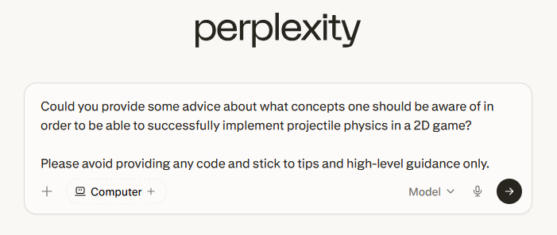
  </a>
</p>
<p align="center"><em>Figure 25. Example of the style of AI prompt used for learning.</em></p>

### 10.2 AI for Asset Generation

The team decided to use AI-generated images for assets in the weapon shop screen as well as the projectile forms of some of the shots in the game. This usage was a mix between generation from scratch and generation based on hand-drawn sketches. A few examples of this usage can be seen in Figure 26.

The rationale behind this usage was to save some much-needed time and with the understanding that graphic design and artistic proficiency are not the primary focus of the Software Engineering unit.

<a id="fig-26"></a>
<p align="center">
  <a href="./images/Concept_art_to_AI_colorisation.png">
    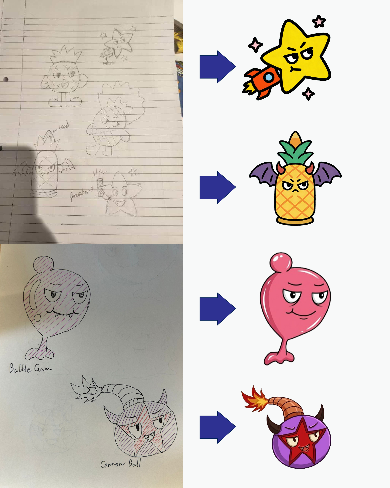
  </a>
</p>
<p align="center"><em>Figure 26. Hand-drawn weapon concepts and their AI-generated colourisations.</em></p>

---

## Appendix

### Appendix A. Weapon Gallery

The repository currently contains a complete static weapon icon set and a partial motion asset set. To preserve the original report content while improving readability, the appendix below centralises the weapon index and links all available visuals in one place.

<a id="appendix-a-weapon-gallery"></a>

| Weapon | Visual | Description |
|---|---|---|
| Cannon Ball | <a href="./docs/weapons/cannonball.png">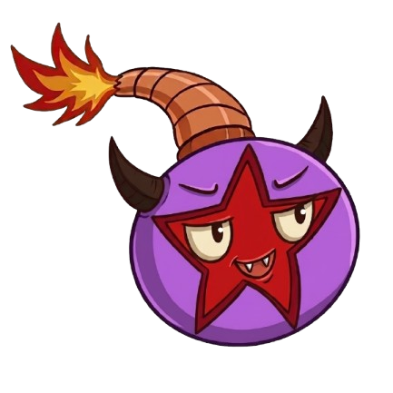</a> | A heavy iron sphere used as a cannon projectile. It increases the score based on explosion distance from the opponent's cannon on impact. |
| Bubblegumshot | <a href="./docs/weapons/bubblegum.png">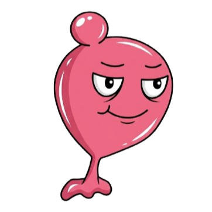</a> | A cute pink bubblegum-like gun with a sticky. Stick to the opponent cannon, preventing movement and skipping the opponent's next turn. |
| Earthworm | <a href="./docs/weapons/earthworm.png">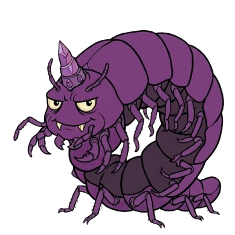</a> | Burrows underground, hiding beneath the terrain. Moves randomly while tracking the opponent's cannon, then explodes on contact. |
| Lazer shot | <a href="./docs/weapons/lazer.png">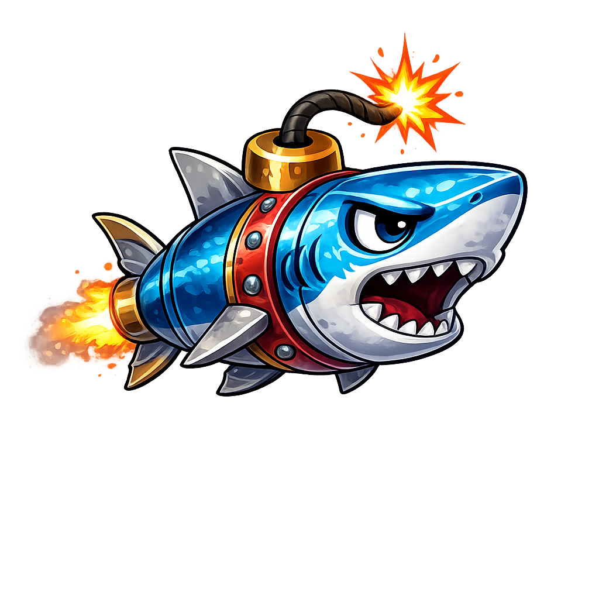</a> | Fires a vertical laser beam from the sky. Slices through targets in a precise straight line. |
| Impact Gun | <a href="./docs/weapons/impactgun.png">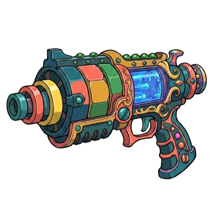</a> | Fires a concentrated energy burst that hits instantly. It releases a powerful shockwave that hits the opponent's cannon on impact. |
| Submarinshot | <a href="./docs/weapons/submarine.png">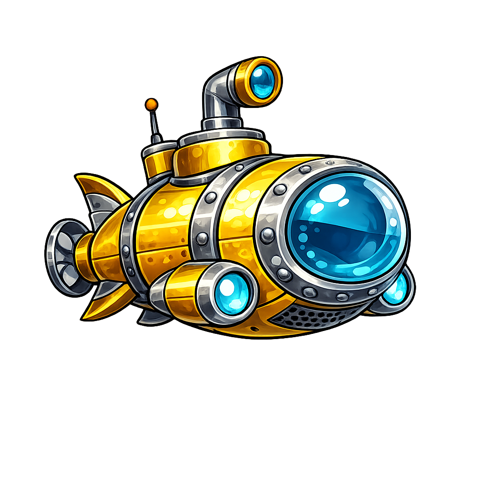</a> | Launches a spinning purple shell through the air. Detonates with a wide-area destructive blast. |
| Pineappleshot | <a href="./docs/weapons/pineapple.png">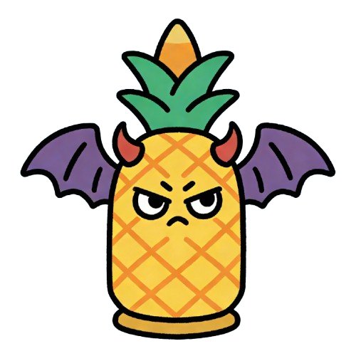</a> | Releases a cloud of toxic purple gas on impact. Envelops enemies in a lingering, harmful haze. |
| Shibashot | <a href="./docs/weapons/shiba.png">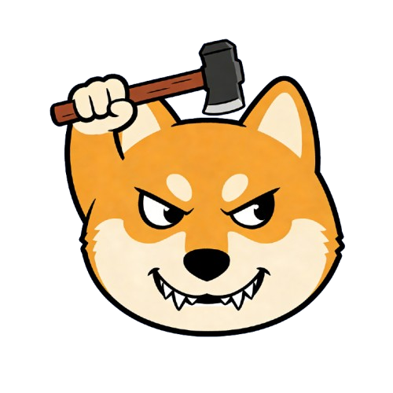</a> | Detonates on contact, launching enemies upward. Sends targets flying with a forceful blast. |
| Starshot | <a href="./docs/weapons/star.png">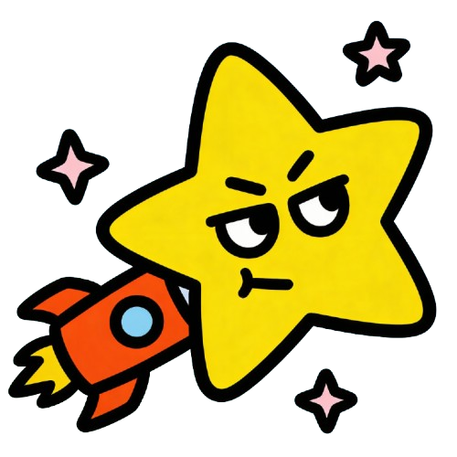</a> | Shatters mid-air into multiple fragments. Each piece detonates on impact, creating scattered explosive bursts. |
| Grapeshot | <a href="./docs/weapons/grape.png">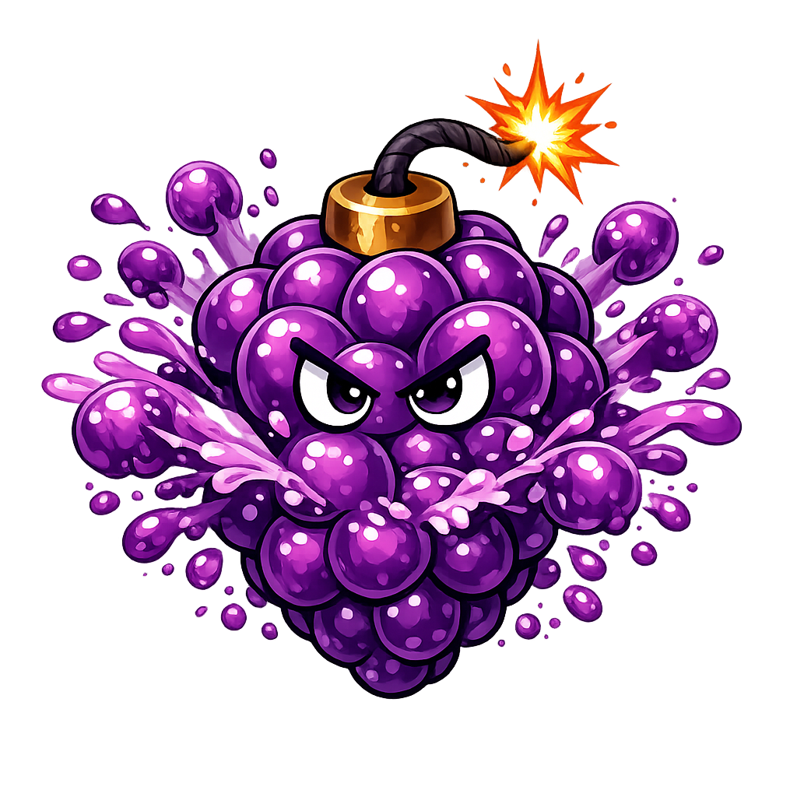</a> | Breaks apart mid-air while linked by chains. Triggers multiple chained explosions on impact. |

### Appendix B. Motion Asset Gallery

<a id="appendix-b-motion-asset-gallery"></a>

| Motion Asset | Preview | Notes |
|---|---|---|
| Start page flow | <a href="./video/startgame.gif"></a> | Main menu / opening flow |
| Weapon shop flow | <a href="./video/weaponshop.gif"></a> | Weapon selection interaction |
| Main gameplay flow | <a href="./video/maingame.gif"></a> | In-match play demonstration |
| Terrain destruction v1 | <a href="./images/Terrain_destruction_v1.gif"></a> | Initial terrain destruction behaviour |
| Terrain destruction v2 | <a href="./images/Terrain_destruction_v2.gif"></a> | Static overhang behaviour |
| Terrain destruction v3 | <a href="./images/Terrain_destruction_v3.gif"></a> | Settling animation, early version |
| Terrain destruction v4 | <a href="./images/Terrain_destruction_v4.gif"></a> | Settling animation, refined version |
| AI aiming optimisation | <a href="./images/Smoother_AI_aiming.gif"></a> | Optimised aiming pass |
| AI aiming stutter | <a href="./images/Wind_particles_stutter.gif"></a> | Original brute-force behaviour |
| AI jitter self-hit | <a href="./images/Aiming_jitter_causing_self_hit.gif"></a> | Hard-mode jitter issue |
| In-person collaboration | <a href="./video/Inperson%20meeting%20gif.gif"></a> | Team development session |

---

## References

<a id="ref1"></a>
[1] Wikipedia contributors. (2024). *God object*. Wikipedia, The Free Encyclopedia. Available at: [https://en.wikipedia.org/wiki/God_object](https://en.wikipedia.org/wiki/God_object).

[2] National Aeronautics and Space Administration (NASA). (2026). *NASA Task Load Index (TLX).* Available at: [https://www.nasa.gov/human-systems-integration-division/nasa-task-load-index-tlx/](https://www.nasa.gov/human-systems-integration-division/nasa-task-load-index-tlx/).

[3] SusAF. *SusAF “Taster” - the sustainability awareness framework: The taster workbook.* Available at: [https://www.ida.liu.se/~TDDD96/info/SusAF%20Taster%20-%20workbook%20-%20V3%20-%20english.pdf](https://www.ida.liu.se/~TDDD96/info/SusAF%20Taster%20-%20workbook%20-%20V3%20-%20english.pdf).
