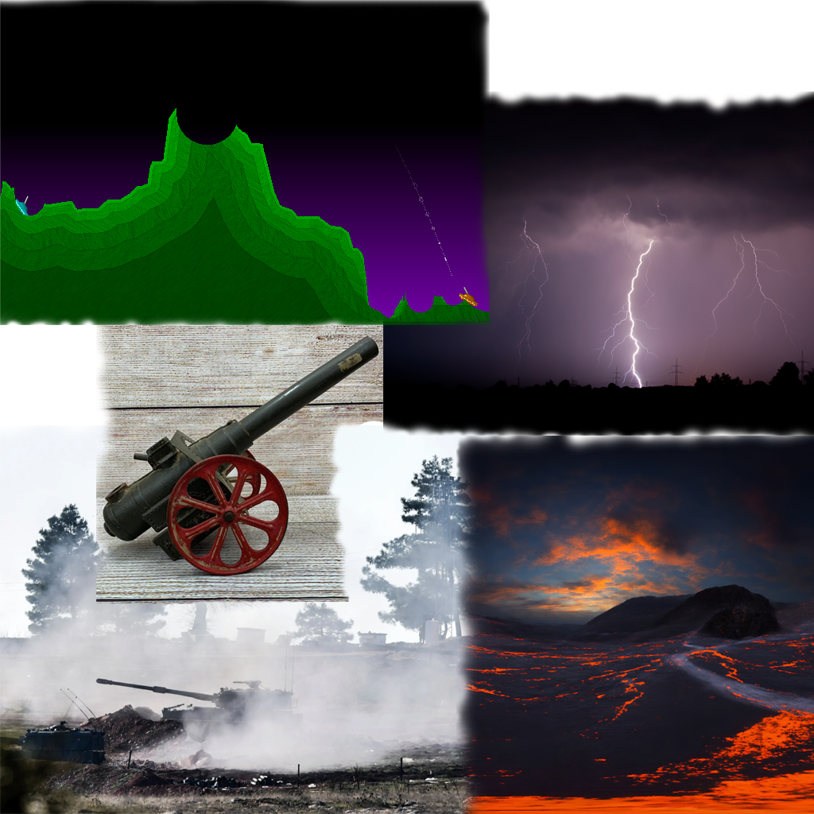

## Game Ideas

 **1. <ins>Hot Cannons</ins>**

The core ideas of Pocket Tanks with random events thrown in and the tank models replaced with cannons on wheels. These could be elemental events which chip at terrain or add new terrain or more abstract events like ones that add an extra turn, make a player skip a turn or teleport both players to a random position different from their current one. The original demo version of Pocket Tanks has 30 different shot types though this could be reduced as required to fit in the project time constraints. The shot types could be a mix between some of those available in Pocket Tanks and others which are original.

Other related ideas could be:
- hazardous layer below the terrain like lava (falling into it results in the automatic win of the enemy player, or a chunk of points awarded for the enemy player and fallen player being teleported on safe ground - but what if all safe ground is destroyed?)
- different media which make shots travel with varying ease (resistive vs non-resistive)
- wraparound for the left and right sides of the screen (so shots which fly off the left side of the screen come back from its right, and vice-versa)
- fog of war - each player can only see in a radius around their cannon but some or all shots reveal the surrounding area as they travel through their trajectory; randomly an event occurs that temporarily reveals the whole map (just for a moment or for a turn or two)

- part of left/right edge of screen covered with blocks which make shots rebound back inside the map

 **2. <ins>Treacherous Tides</ins>**
 The core mechanics of Cutthroat Island reimagined as a "God-Sim" or "Dungeon Master" style game. Instead of controlling the protagonists, the player controls the environment and the antagonist forces to prevent the heroes from assembling the treasure map. You act as the unseen hand of fate (or the vengeful Ghost of the Island), utilizing a deck of "Calamity Cards" or a mana-based system to trigger environmental traps, command pirate goons, or directly intervene as a Boss.
 Other related ideas could be:
 - Dynamic Terrain Destruction: The player can "click and crumble" platforms or bridges just as the hero is about to jump. If the hero falls into the sea, they don't necessarily die but are reset with a penalty, or the player gains "Infamy Points" to buy stronger traps.
- The "Boss Avatar" Mode: At the end of each stage, instead of watching an AI fight, the player possesses the movie’s villain. You gain a specialized UI to perform heavy attacks, summon reinforcements, or throw bombs, turning the game into a 2D fighting game where you are the final hurdle.
- Elemental Sabotage: Players can trigger "Scripted Disasters" based on the movie’s settings.
- The Map Scramble: As a divine entity, you can physically move map pieces further into the level or hide them behind difficult enemies, forcing the AI hero to take the longest, most dangerous path possible.
